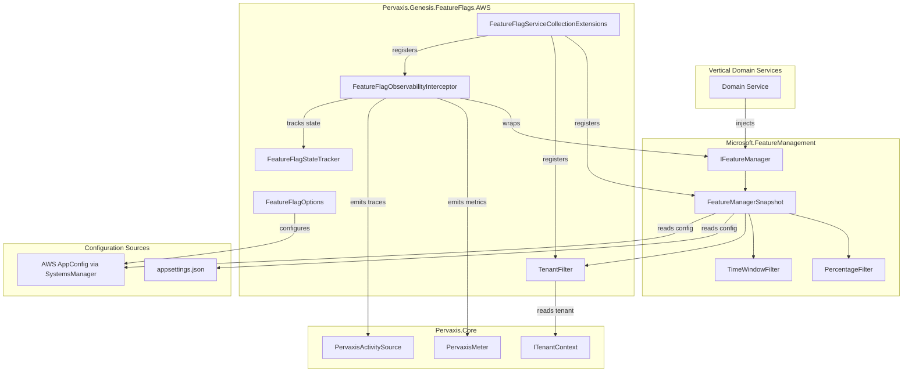
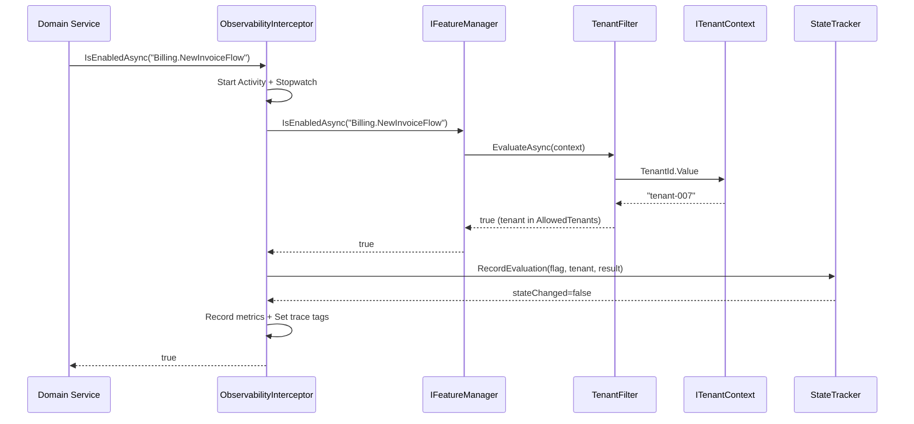
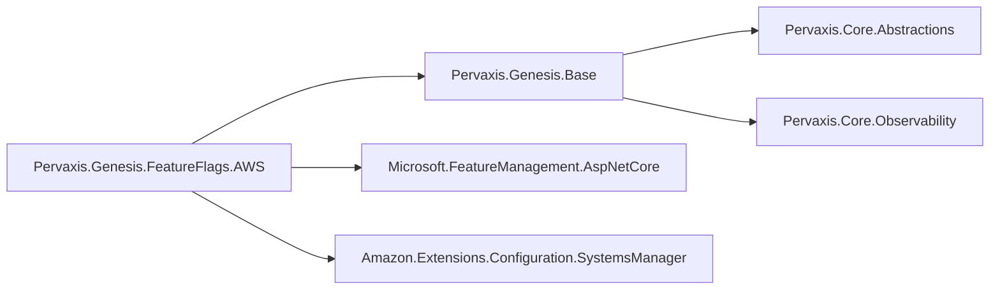

# Design Document: Genesis Feature Flags

## Overview

The Genesis Feature Flags module (`Pervaxis.Genesis.FeatureFlags.AWS`) provides feature flag infrastructure to all vertical domain services in the Pervaxis platform. It wraps Microsoft.FeatureManagement with AWS AppConfig as the production configuration source, adds a custom `TenantFilter` for per-tenant targeting, and instruments all evaluations with the standard Genesis observability stack (metrics, tracing, state-change logging).

Vertical services consume flags exclusively through `IFeatureManager` — the same interface they'd use with vanilla Microsoft.FeatureManagement — meaning zero Genesis-specific abstractions leak into domain code.

### Design Goals

1. **Zero new abstraction in Pervaxis.Core.Abstractions** — verticals inject `IFeatureManager` directly
2. **Standard Genesis registration pattern** — `AddGenesisFeatureFlags` extension method
3. **Cloud-provider separation** — implementation lives in `.FeatureFlags.AWS`; base logic (TenantFilter, observability) can be extracted later
4. **Observability parity** — same metrics/tracing/logging patterns as other Genesis providers
5. **Resilient by default** — exponential backoff + circuit breaker for AppConfig polling

## Architecture

### Component Diagram



### Data Flow — Flag Evaluation



### Package Dependencies



## Components and Interfaces

### 1. FeatureFlagOptions

Options class extending `GenesisOptionsBase` for configuring the module.

```csharp
namespace Pervaxis.Genesis.FeatureFlags.AWS.Options;

/// <summary>
/// Configuration options for the Genesis Feature Flags module (AWS AppConfig).
/// Follows the <c>{Domain}.{Feature}</c> naming convention for flag identifiers.
/// Example: <c>"Billing.NewInvoiceFlow"</c>
/// </summary>
public sealed class FeatureFlagOptions : GenesisOptionsBase
{
    /// <summary>
    /// Gets or sets the AWS AppConfig parameter path.
    /// Supports <c>{env}</c> placeholder replaced at runtime with the hosting environment name.
    /// Example: "/pervaxis/{env}/feature-flags"
    /// </summary>
    public string AppConfigPath { get; set; } = string.Empty;

    /// <summary>
    /// Gets or sets the polling interval in seconds for AppConfig changes.
    /// Valid range: 10–300. Default: 30.
    /// </summary>
    public int PollingIntervalSeconds { get; set; } = 30;

    /// <summary>
    /// Gets or sets the resilience policy configuration for AppConfig polling.
    /// </summary>
    public ResilienceOptions Resilience { get; set; } = new();

    /// <summary>
    /// Gets or sets whether to enable tenant isolation in metric tags.
    /// Default: true.
    /// </summary>
    public bool EnableTenantIsolation { get; set; } = true;

    /// <inheritdoc/>
    public override bool Validate()
    {
        if (!base.Validate())
            return false;

        if (!UseLocalEmulator && string.IsNullOrWhiteSpace(AppConfigPath))
            return false;

        if (PollingIntervalSeconds is < 10 or > 300)
            return false;

        if (!Resilience.Validate())
            return false;

        return true;
    }
}
```

### 2. TenantFilter

Custom `IFeatureFilter` for per-tenant flag targeting.

```csharp
namespace Pervaxis.Genesis.FeatureFlags.AWS.Filters;

/// <summary>
/// Feature filter that evaluates flag state based on the current tenant identity.
/// Matches the current tenant ID against a configured list of allowed tenants
/// using case-insensitive ordinal comparison.
/// </summary>
[FilterAlias("Tenant")]
public sealed class TenantFilter : IFeatureFilter
{
    private readonly ITenantContext? _tenantContext;

    public TenantFilter(ITenantContext? tenantContext = null)
    {
        _tenantContext = tenantContext;
    }

    public Task<bool> EvaluateAsync(FeatureFilterEvaluationContext context)
    {
        if (_tenantContext is null || !_tenantContext.IsResolved)
            return Task.FromResult(false);

        var tenantId = _tenantContext.TenantId.Value.ToString();
        var allowedTenants = context.Parameters
            .GetSection("AllowedTenants")
            .Get<string[]>() ?? [];

        if (allowedTenants.Length == 0)
            return Task.FromResult(false);

        var isAllowed = allowedTenants.Contains(
            tenantId, StringComparer.OrdinalIgnoreCase);

        return Task.FromResult(isAllowed);
    }
}
```

### 3. FeatureFlagObservabilityInterceptor

Decorator around `IFeatureManager` that adds metrics, tracing, and state-change detection.

```csharp
namespace Pervaxis.Genesis.FeatureFlags.AWS.Observability;

/// <summary>
/// Decorates IFeatureManager to add Genesis observability (metrics, traces, state-change logging).
/// Registered as a singleton wrapping the underlying feature manager.
/// </summary>
public sealed class FeatureFlagObservabilityInterceptor : IFeatureManager
{
    private readonly IFeatureManager _inner;
    private readonly FeatureFlagStateTracker _stateTracker;
    private readonly ITenantContext? _tenantContext;
    private readonly FeatureFlagOptions _options;
    private readonly ILogger<FeatureFlagObservabilityInterceptor> _logger;

    // Metrics — static readonly per Genesis pattern
    private static readonly Counter<long> _evaluationsCounter =
        PervaxisMeter.CreateCounter<long>(
            "genesis.featureflags.evaluations", "1",
            "Total number of feature flag evaluations");

    private static readonly Counter<long> _fallbackCounter =
        PervaxisMeter.CreateCounter<long>(
            "genesis.featureflags.appconfig.fallback", "1",
            "Number of times AppConfig fallback to appsettings occurred");

    private static readonly Histogram<double> _evaluationDuration =
        PervaxisMeter.CreateHistogram<double>(
            "genesis.featureflags.evaluation.duration", "ms",
            "Duration of feature flag evaluations in milliseconds");

    public async Task<bool> IsEnabledAsync(string feature)
    {
        var stopwatch = Stopwatch.StartNew();
        using var activity = PervaxisActivitySource.StartActivity(
            "featureflags.evaluate", ActivityKind.Internal);
        activity?.SetTag("featureflags.flag_name", feature);
        AddTenantTags(activity);

        try
        {
            var result = await _inner.IsEnabledAsync(feature);
            var resultTag = result ? "enabled" : "disabled";

            activity?.SetTag("featureflags.result", resultTag);
            RecordMetrics(feature, resultTag, stopwatch);
            _stateTracker.RecordEvaluation(feature, GetTenantKey(), result, _logger);

            return result;
        }
        catch (Exception ex)
        {
            activity?.SetStatus(ActivityStatusCode.Error, ex.Message);
            RecordMetrics(feature, "error", stopwatch);
            throw;
        }
    }

    public async Task<bool> IsEnabledAsync<TContext>(string feature, TContext context)
    {
        // Same pattern as IsEnabledAsync(string)
        // with context passed to inner
    }

    public IAsyncEnumerable<string> GetFeatureNamesAsync()
        => _inner.GetFeatureNamesAsync();

    // ... helper methods: RecordMetrics, AddTenantTags, GetTenantKey
}
```

### 4. FeatureFlagStateTracker

Tracks per-flag-per-tenant last-known state; logs only on transitions.

```csharp
namespace Pervaxis.Genesis.FeatureFlags.AWS.Observability;

/// <summary>
/// Tracks the last-known evaluated state per flag per tenant (or per process when no tenant).
/// Emits structured Information-level logs only when state transitions occur.
/// Thread-safe via ConcurrentDictionary.
/// </summary>
public sealed class FeatureFlagStateTracker
{
    private readonly ConcurrentDictionary<string, bool> _lastKnownStates = new();

    /// <summary>
    /// Records an evaluation result and logs if a state transition occurred.
    /// </summary>
    /// <param name="flagName">The flag name.</param>
    /// <param name="tenantKey">Tenant-scoped key (or empty for process-level).</param>
    /// <param name="currentResult">The current evaluation result.</param>
    /// <param name="logger">Logger for state transition messages.</param>
    public void RecordEvaluation(
        string flagName, string tenantKey, bool currentResult, ILogger logger)
    {
        var compositeKey = string.IsNullOrEmpty(tenantKey)
            ? flagName
            : $"{flagName}:{tenantKey}";

        var previousState = _lastKnownStates.AddOrUpdate(
            compositeKey,
            addValueFactory: _ => currentResult,   // first time: record baseline
            updateValueFactory: (_, prev) => currentResult);

        // Only log on transition (not first evaluation)
        if (_lastKnownStates.ContainsKey(compositeKey) && previousState != currentResult)
        {
            logger.LogInformation(
                "Feature flag state changed: Flag={FlagName}, Previous={PreviousState}, " +
                "New={NewState}, Tenant={TenantKey}, Timestamp={Timestamp:O}",
                flagName,
                previousState ? "enabled" : "disabled",
                currentResult ? "enabled" : "disabled",
                tenantKey,
                DateTime.UtcNow);
        }
    }
}
```

### 5. FeatureFlagServiceCollectionExtensions

DI registration following the Genesis pattern.

```csharp
namespace Pervaxis.Genesis.FeatureFlags.AWS.Extensions;

public static class FeatureFlagServiceCollectionExtensions
{
    /// <summary>
    /// Adds Genesis Feature Flags services using AWS AppConfig provider.
    /// </summary>
    public static IServiceCollection AddGenesisFeatureFlags(
        this IServiceCollection services,
        IConfiguration configuration)
    {
        ArgumentNullException.ThrowIfNull(services);
        ArgumentNullException.ThrowIfNull(configuration);

        services.Configure<FeatureFlagOptions>(
            configuration.GetSection("Genesis:FeatureFlags"));

        RegisterCoreServices(services);
        return services;
    }

    /// <summary>
    /// Adds Genesis Feature Flags services with action-based configuration.
    /// </summary>
    public static IServiceCollection AddGenesisFeatureFlags(
        this IServiceCollection services,
        Action<FeatureFlagOptions> configureOptions)
    {
        ArgumentNullException.ThrowIfNull(services);
        ArgumentNullException.ThrowIfNull(configureOptions);

        services.Configure(configureOptions);

        RegisterCoreServices(services);
        return services;
    }

    private static void RegisterCoreServices(IServiceCollection services)
    {
        // Register Microsoft.FeatureManagement with built-in + custom filters
        services.AddFeatureManagement()
            .AddFeatureFilter<PercentageFilter>()
            .AddFeatureFilter<TimeWindowFilter>()
            .AddFeatureFilter<TenantFilter>();

        // Register state tracker as singleton
        services.TryAddSingleton<FeatureFlagStateTracker>();

        // Decorate IFeatureManager with observability interceptor
        services.Decorate<IFeatureManager, FeatureFlagObservabilityInterceptor>();
    }
}
```

### 6. AppConfig Configuration Source Registration

Wires AWS AppConfig into the configuration pipeline for non-local environments.

```csharp
namespace Pervaxis.Genesis.FeatureFlags.AWS.Extensions;

public static class FeatureFlagConfigurationExtensions
{
    /// <summary>
    /// Adds AWS AppConfig as a configuration source for feature flags.
    /// Should be called on the IConfigurationBuilder during host startup.
    /// Skipped in Development environment.
    /// </summary>
    public static IConfigurationBuilder AddGenesisFeatureFlagSource(
        this IConfigurationBuilder builder,
        IHostEnvironment environment,
        FeatureFlagOptions options)
    {
        ArgumentNullException.ThrowIfNull(builder);
        ArgumentNullException.ThrowIfNull(environment);
        ArgumentNullException.ThrowIfNull(options);

        if (environment.IsDevelopment())
            return builder; // Local dev uses appsettings only

        var resolvedPath = options.AppConfigPath
            .Replace("{env}", environment.EnvironmentName, StringComparison.OrdinalIgnoreCase);

        if (string.IsNullOrWhiteSpace(resolvedPath))
            return builder; // Warning logged at options validation

        builder.AddSystemsManager(source =>
        {
            source.Path = resolvedPath;
            source.ReloadAfter = TimeSpan.FromSeconds(options.PollingIntervalSeconds);
            source.Optional = true; // Fallback to appsettings if unavailable
        });

        return builder;
    }
}
```

## Data Models

### Configuration JSON Structure

```json
{
  "Genesis": {
    "FeatureFlags": {
      "AppConfigPath": "/pervaxis/{env}/feature-flags",
      "PollingIntervalSeconds": 30,
      "UseLocalEmulator": false,
      "EnableTenantIsolation": true,
      "Resilience": {
        "Enabled": true,
        "RetryCount": 3,
        "RetryDelayMs": 1000,
        "MaxRetryDelayMs": 30000,
        "CircuitBreakerFailureThreshold": 0.5,
        "CircuitBreakerMinimumThroughput": 10,
        "CircuitBreakerDurationSeconds": 60,
        "CircuitBreakerSamplingDurationSeconds": 30,
        "TimeoutSeconds": 30
      }
    }
  },
  "FeatureManagement": {
    "Billing.NewInvoiceFlow": {
      "EnabledFor": [
        {
          "Name": "Tenant",
          "Parameters": {
            "AllowedTenants": ["tenant-001", "tenant-007"]
          }
        }
      ]
    },
    "Platform.DarkMode": true,
    "Marketing.SummerCampaign": {
      "EnabledFor": [
        {
          "Name": "TimeWindow",
          "Parameters": {
            "Start": "2026-06-01T00:00:00Z",
            "End": "2026-08-31T23:59:59Z"
          }
        }
      ]
    }
  }
}
```

### AWS AppConfig Parameter Structure

Path: `/pervaxis/{env}/feature-flags`

The AppConfig JSON is identical to the `FeatureManagement` section above. The `Amazon.Extensions.Configuration.SystemsManager` package merges it into the configuration tree, making it indistinguishable from appsettings to Microsoft.FeatureManagement.

### Project File (`.csproj`)

```xml
<Project Sdk="Microsoft.NET.Sdk">
  <PropertyGroup>
    <TargetFramework>net10.0</TargetFramework>
    <ImplicitUsings>enable</ImplicitUsings>
    <Nullable>enable</Nullable>
    <GenerateDocumentationFile>true</GenerateDocumentationFile>
  </PropertyGroup>

  <ItemGroup>
    <PackageReference Include="Microsoft.FeatureManagement.AspNetCore" Version="4.0.0" />
    <PackageReference Include="Amazon.Extensions.Configuration.SystemsManager" Version="6.3.0" />
    <PackageReference Include="Microsoft.Extensions.Configuration.Abstractions" Version="10.0.0" />
    <PackageReference Include="Microsoft.Extensions.Configuration.Binder" Version="10.0.0" />
    <PackageReference Include="Microsoft.Extensions.DependencyInjection.Abstractions" Version="10.0.0" />
    <PackageReference Include="Microsoft.Extensions.Hosting.Abstractions" Version="10.0.0" />
    <PackageReference Include="Microsoft.Extensions.Logging.Abstractions" Version="10.0.0" />
    <PackageReference Include="Microsoft.Extensions.Options.ConfigurationExtensions" Version="10.0.0" />
    <PackageReference Include="Scrutor" Version="5.0.1" />
  </ItemGroup>

  <ItemGroup>
    <ProjectReference Include="..\Pervaxis.Genesis.Base\Pervaxis.Genesis.Base.csproj" />
  </ItemGroup>

  <ItemGroup>
    <InternalsVisibleTo Include="Pervaxis.Genesis.FeatureFlags.AWS.Tests" />
  </ItemGroup>
</Project>
```

### Folder Structure

```
src/Pervaxis.Genesis.FeatureFlags.AWS/
├── Extensions/
│   ├── FeatureFlagServiceCollectionExtensions.cs
│   └── FeatureFlagConfigurationExtensions.cs
├── Filters/
│   └── TenantFilter.cs
├── Observability/
│   ├── FeatureFlagObservabilityInterceptor.cs
│   └── FeatureFlagStateTracker.cs
├── Options/
│   └── FeatureFlagOptions.cs
├── Pervaxis.Genesis.FeatureFlags.AWS.csproj
└── README.md
```

## Correctness Properties

*A property is a characteristic or behavior that should hold true across all valid executions of a system — essentially, a formal statement about what the system should do. Properties serve as the bridge between human-readable specifications and machine-verifiable correctness guarantees.*

### Property 1: Options validation rejects out-of-range polling intervals

*For any* integer value assigned to `PollingIntervalSeconds`, `FeatureFlagOptions.Validate()` SHALL return true if and only if the value is in the range [10, 300] (given all other properties are valid).

**Validates: Requirements 2.3, 2.7**

### Property 2: AppConfigPath {env} placeholder resolution

*For any* non-empty environment name string and any `AppConfigPath` containing the literal `{env}`, resolving the path SHALL produce a string where every occurrence of `{env}` is replaced with the environment name and the result contains no remaining `{env}` literals.

**Validates: Requirements 2.5**

### Property 3: Options validation rejects empty AppConfigPath in non-emulator mode

*For any* `FeatureFlagOptions` instance where `AppConfigPath` is null, empty, or whitespace AND `UseLocalEmulator` is false, `Validate()` SHALL return false.

**Validates: Requirements 2.6**

### Property 4: Options validation propagates Resilience validation failure

*For any* `FeatureFlagOptions` instance where the nested `Resilience` property produces `Validate() == false`, the parent `FeatureFlagOptions.Validate()` SHALL also return false.

**Validates: Requirements 2.8**

### Property 5: Undefined flags evaluate as disabled

*For any* flag name string that is not present in the feature management configuration, `IsEnabledAsync(flagName)` SHALL return false.

**Validates: Requirements 4.2, 6.3**

### Property 6: TenantFilter evaluates correctly based on AllowedTenants membership

*For any* tenant ID string and any non-empty `AllowedTenants` list, the TenantFilter SHALL evaluate to true if and only if the tenant ID matches an entry in the list using case-insensitive ordinal comparison. If `AllowedTenants` is empty or null, or `ITenantContext` is null/unresolved, the filter SHALL evaluate to false.

**Validates: Requirements 8.1, 8.2, 8.3, 8.4, 8.6**

### Property 7: Every flag evaluation emits correct observability metrics

*For any* flag evaluation (flag name, tenant context, result), the observability interceptor SHALL increment the `genesis.featureflags.evaluations` counter with tags `flag_name`, `result` (enabled/disabled/error), and `tenant_id` (when tenant isolation is active), and SHALL record a non-negative duration value in the `genesis.featureflags.evaluation.duration` histogram with matching tags.

**Validates: Requirements 10.1, 10.3, 10.5**

### Property 8: Every flag evaluation creates a trace activity with correct tags

*For any* flag evaluation, the observability interceptor SHALL create a trace activity with span name `featureflags.evaluate`, ActivityKind `Internal`, and SHALL set tags `featureflags.flag_name` and `featureflags.result` matching the evaluation parameters. When `ITenantContext` is resolved, `tenant.id` and `tenant.name` tags SHALL also be present.

**Validates: Requirements 11.1, 11.2, 11.4**

### Property 9: State change logs emitted only on transitions

*For any* sequence of N flag evaluations for the same flag and tenant where the result is constant, the state tracker SHALL emit zero transition logs after the initial baseline recording. When the result changes from the last-known state, exactly one Information-level log SHALL be emitted containing the flag name, previous state, new state, and UTC timestamp.

**Validates: Requirements 12.1, 12.2, 12.4**

### Property 10: Flag naming convention validation

*For any* string, the naming convention check SHALL classify it as conforming if and only if it matches the pattern `^[A-Za-z0-9]+\.[A-Za-z0-9]+$` and its total length does not exceed 128 characters.

**Validates: Requirements 13.1**

### Property 11: Runtime accepts any non-empty flag name up to 256 characters

*For any* non-empty string of length ≤ 256 characters, calling `IsEnabledAsync(flagName)` SHALL NOT throw a validation exception (it may return false for undefined flags, but must not reject the input).

**Validates: Requirements 13.2**

## Error Handling

| Scenario | Behavior | Fallback |
|----------|----------|----------|
| AppConfig unreachable on startup | Log warning, start with appsettings values | `FeatureManagement` section in appsettings |
| AppConfig unreachable during poll | Continue with last cached values, log warning, increment fallback counter | Previously retrieved config |
| Cold start + AppConfig unreachable + retries exhausted | All flags evaluate as disabled, log warning | `false` for all |
| Missing `FeatureManagement` section | Start successfully, all flags disabled | `false` for all |
| `ITenantContext` null/unresolved | TenantFilter returns false; metrics omit `tenant_id` tag | Flag disabled for tenant-gated features |
| Filter evaluation throws exception | Catch, log error, return `false` | Disabled |
| Invalid `FeatureFlagOptions` | `GenesisConfigurationException` at startup | Fast fail — prevents misconfigured service from starting |
| Null parameters to `AddGenesisFeatureFlags` | `ArgumentNullException` with parameter name | Fast fail |

### Exception Hierarchy

- `GenesisConfigurationException` — invalid options detected during registration
- Standard `ArgumentNullException` — null guard failures on public API
- All transient errors from AppConfig are handled internally (retry + fallback), never propagated to callers of `IsEnabledAsync`

## Testing Strategy

### Unit Tests (xUnit + NSubstitute)

Focus areas:
- `FeatureFlagOptions.Validate()` — boundary values for all validation rules
- `TenantFilter.EvaluateAsync()` — tenant matching, null context, empty AllowedTenants
- `FeatureFlagStateTracker` — transition detection, first-evaluation baseline, per-tenant isolation
- `FeatureFlagObservabilityInterceptor` — metrics emission, trace creation, error handling
- `FeatureFlagServiceCollectionExtensions` — null guards, DI registration verification
- `FeatureFlagConfigurationExtensions` — `{env}` replacement, Development skip behavior

### Property-Based Tests (FsCheck via FsCheck.Xunit)

**Library:** FsCheck.Xunit (C# property-based testing via FsCheck for .NET)

**Configuration:** Minimum 100 iterations per property test.

**Tag format:** `// Feature: genesis-feature-flags, Property {N}: {description}`

Each correctness property (1–11) is implemented as a single property-based test:

| Property | Generator Strategy |
|----------|-------------------|
| P1: Polling interval validation | Random integers (int.MinValue to int.MaxValue) |
| P2: {env} replacement | Random alphanumeric strings for env name + paths with/without {env} |
| P3: Empty AppConfigPath validation | Random whitespace/null/empty strings |
| P4: Resilience validation propagation | Random ResilienceOptions with invalid field combinations |
| P5: Undefined flag returns false | Random flag name strings not in a fixed config set |
| P6: TenantFilter matching | Random tenant IDs + AllowedTenants lists with case variations |
| P7: Metrics emission | Random flag names + evaluation outcomes |
| P8: Trace activity creation | Random flag names + tenant contexts |
| P9: State transition logging | Random sequences of (flag, tenant, bool) evaluations |
| P10: Naming convention check | Random strings (valid and invalid patterns) |
| P11: Runtime flag name acceptance | Random non-empty strings up to 256 chars |

### Integration Tests

- Full DI container setup with `WebApplicationFactory`
- AppConfig mocked via `IConfiguration` substitution
- `[FeatureGate]` attribute behavior via HTTP test client
- Fallback behavior with simulated AppConfig failures
- Recovery behavior after AppConfig restoration

### Test Project Structure

```
tests/Pervaxis.Genesis.FeatureFlags.AWS.Tests/
├── Unit/
│   ├── Options/
│   │   └── FeatureFlagOptionsValidationTests.cs
│   ├── Filters/
│   │   └── TenantFilterTests.cs
│   ├── Observability/
│   │   ├── ObservabilityInterceptorTests.cs
│   │   └── StateTrackerTests.cs
│   └── Extensions/
│       └── ServiceCollectionExtensionsTests.cs
├── Properties/
│   ├── OptionsValidationProperties.cs
│   ├── TenantFilterProperties.cs
│   ├── ObservabilityProperties.cs
│   ├── StateTrackerProperties.cs
│   └── NamingConventionProperties.cs
└── Integration/
    ├── FeatureGateIntegrationTests.cs
    └── FallbackBehaviorTests.cs
```
