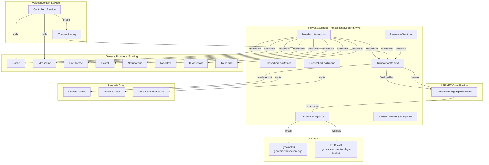
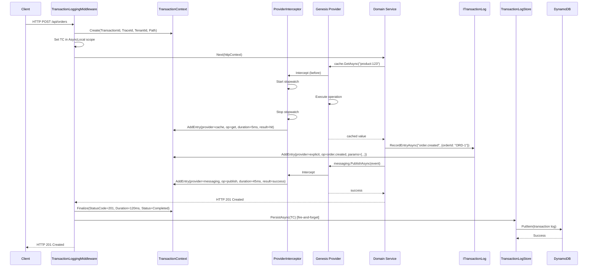
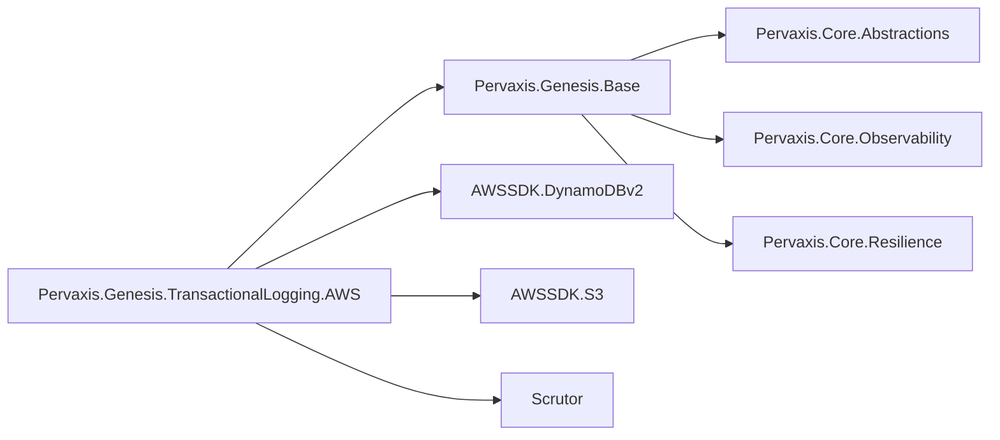

# Design Document: Genesis Transactional Logging

## Overview

The Genesis Transactional Logging module (`Pervaxis.Genesis.TransactionalLogging.AWS`) provides audit-grade, per-request operation logging across all Genesis providers. It uses decorator/interceptor patterns to implicitly capture every Genesis provider call within a request scope, while also exposing `ITransactionLog` for explicit business-level entries. Persistence uses DynamoDB for hot queries and S3 for long-term compliance archival.

The module follows established Genesis patterns:
- **Standard DI registration** via `AddGenesisTransactionalLogging` extension methods
- **Options validation** extending `GenesisOptionsBase`
- **Resilience** via `GenesisResiliencePipelineBuilder` (retry, circuit breaker, timeout)
- **Observability** via `PervaxisMeter`, `PervaxisActivitySource`, and `ILogger<T>` with source-generated `LoggerMessage`
- **Multi-tenancy** via `ITenantContext` for record isolation
- **Fail-open** — logging failures never impact the business request

### Design Goals

1. **Zero-effort audit logging** — verticals get full transaction logs without writing code
2. **Explicit enrichment** — developers can add business-level entries to the same log
3. **Service-level control** — configurable per service, per endpoint, per provider
4. **Compliance-ready** — long-term S3 archival with tenant isolation and Object Lock support
5. **Non-invasive** — fail-open, async persistence, <2ms synchronous overhead

## Architecture

### Component Diagram



### Request Flow Sequence



### Package Dependencies



## Components and Interfaces

### 1. TransactionalLoggingOptions

```csharp
namespace Pervaxis.Genesis.TransactionalLogging.AWS.Options;

/// <summary>
/// Configuration options for the Genesis Transactional Logging module.
/// Controls capture behavior, storage targets, retention, and sanitization.
/// </summary>
public sealed class TransactionalLoggingOptions : GenesisOptionsBase
{
    /// <summary>
    /// Gets or sets whether the module is active. When false, all operations no-op.
    /// Default: true.
    /// </summary>
    public bool Enabled { get; set; } = true;

    /// <summary>
    /// Gets or sets whether provider interceptors automatically record operations.
    /// Default: true.
    /// </summary>
    public bool ImplicitCapture { get; set; } = true;

    /// <summary>
    /// Gets or sets which Genesis providers to capture implicitly.
    /// Empty list means all providers. Case-insensitive matching.
    /// </summary>
    public List<string> CaptureProviders { get; set; } = new();

    /// <summary>
    /// Gets or sets which Genesis providers to exclude from implicit capture.
    /// Case-insensitive matching. Takes precedence over CaptureProviders.
    /// </summary>
    public List<string> ExcludeProviders { get; set; } = new();

    /// <summary>
    /// Gets or sets which operations to exclude from implicit capture.
    /// Format: "provider.operation" (e.g., "cache.get"). Case-insensitive.
    /// </summary>
    public List<string> ExcludeOperations { get; set; } = new();

    /// <summary>
    /// Gets or sets the minimum operation duration (ms) before an entry is captured.
    /// 0 means capture all operations. Default: 0.
    /// </summary>
    public int MinimumDurationMs { get; set; } = 0;

    /// <summary>
    /// Gets or sets the DynamoDB table name for the hot store.
    /// Default: "genesis-transaction-logs".
    /// </summary>
    public string TableName { get; set; } = "genesis-transaction-logs";

    /// <summary>
    /// Gets or sets the S3 bucket name for cold store archival.
    /// Default: "genesis-transaction-logs-archive".
    /// </summary>
    public string BucketName { get; set; } = "genesis-transaction-logs-archive";

    /// <summary>
    /// Gets or sets how many days records stay in DynamoDB before archival.
    /// Valid range: 1-365. Default: 30.
    /// </summary>
    public int HotRetentionDays { get; set; } = 30;

    /// <summary>
    /// Gets or sets how many days records stay in S3.
    /// Valid range: 30-3650. Must be >= HotRetentionDays. Default: 2555 (7 years).
    /// </summary>
    public int ColdRetentionDays { get; set; } = 2555;

    /// <summary>
    /// Gets or sets whether to enable tenant isolation in storage keys.
    /// Default: true.
    /// </summary>
    public bool EnableTenantIsolation { get; set; } = true;

    /// <summary>
    /// Gets or sets whether to sanitize sensitive parameters before storage.
    /// Default: true.
    /// </summary>
    public bool SanitizeParameters { get; set; } = true;

    /// <summary>
    /// Gets or sets custom sensitive key patterns for sanitization.
    /// Added to built-in patterns (password, secret, token, key, credential, auth, connectionstring).
    /// </summary>
    public List<string> SensitiveKeys { get; set; } = new();

    /// <summary>
    /// Gets or sets route patterns to suppress from transaction logging.
    /// Supports ASP.NET Core route template patterns. Example: "/health", "/metrics".
    /// </summary>
    public List<string> SuppressRoutes { get; set; } = new();

    /// <summary>
    /// Gets or sets whether to enable S3 Object Lock for compliance.
    /// Default: false.
    /// </summary>
    public bool EnableObjectLock { get; set; } = false;

    /// <summary>
    /// Gets or sets the resilience policy configuration for store operations.
    /// </summary>
    public ResilienceOptions Resilience { get; set; } = new();

    /// <inheritdoc/>
    public override bool Validate()
    {
        if (!base.Validate())
            return false;

        if (Enabled && !UseLocalEmulator && string.IsNullOrWhiteSpace(TableName))
            return false;

        if (HotRetentionDays is < 1 or > 365)
            return false;

        if (ColdRetentionDays is < 30 or > 3650)
            return false;

        if (ColdRetentionDays < HotRetentionDays)
            return false;

        if (!Resilience.Validate())
            return false;

        return true;
    }
}
```

### 2. TransactionContext

```csharp
namespace Pervaxis.Genesis.TransactionalLogging.AWS.Context;

/// <summary>
/// Scoped context that accumulates operation entries for one logical transaction.
/// Created per HTTP request by the middleware, or explicitly via BeginScopeAsync.
/// Thread-safe for concurrent entry additions.
/// </summary>
public sealed class TransactionContext
{
    private readonly ConcurrentBag<TransactionLogEntry> _entries = new();
    private readonly ConcurrentDictionary<string, string> _businessKeys = new();

    /// <summary>Unique transaction identifier (format: txn_{Guid:N}).</summary>
    public string TransactionId { get; } = $"txn_{Guid.NewGuid():N}";

    /// <summary>Distributed trace ID from Activity.Current.</summary>
    public string? TraceId { get; init; }

    /// <summary>Tenant ID from ITenantContext.</summary>
    public string? TenantId { get; init; }

    /// <summary>HTTP method of the request.</summary>
    public string? HttpMethod { get; init; }

    /// <summary>Request path.</summary>
    public string? RequestPath { get; init; }

    /// <summary>Idempotency key from request header (when present).</summary>
    public string? IdempotencyKey { get; init; }

    /// <summary>Correlation ID from X-Correlation-Id header (when present).</summary>
    public string? CorrelationId { get; init; }

    /// <summary>UTC timestamp when the transaction started.</summary>
    public DateTimeOffset StartTimestamp { get; } = DateTimeOffset.UtcNow;

    /// <summary>UTC timestamp when the transaction ended.</summary>
    public DateTimeOffset? EndTimestamp { get; private set; }

    /// <summary>Total duration in milliseconds.</summary>
    public double? DurationMs { get; private set; }

    /// <summary>HTTP status code of the response.</summary>
    public int? HttpStatusCode { get; private set; }

    /// <summary>Transaction status.</summary>
    public TransactionLogStatus Status { get; private set; } = TransactionLogStatus.InProgress;

    /// <summary>Exception type if the transaction failed.</summary>
    public string? ErrorType { get; private set; }

    /// <summary>Exception message if the transaction failed.</summary>
    public string? ErrorMessage { get; private set; }

    /// <summary>All recorded entries in this transaction.</summary>
    public IReadOnlyCollection<TransactionLogEntry> Entries => _entries.ToArray();

    /// <summary>Business keys attached for queryability.</summary>
    public IReadOnlyDictionary<string, string> BusinessKeys =>
        _businessKeys.ToDictionary(kv => kv.Key, kv => kv.Value);

    /// <summary>Adds an operation entry to the transaction.</summary>
    public void AddEntry(TransactionLogEntry entry) => _entries.Add(entry);

    /// <summary>Attaches a business key for query support.</summary>
    public void AddBusinessKey(string key, string value) =>
        _businessKeys.TryAdd(key, value);

    /// <summary>Finalizes the transaction with completion information.</summary>
    public void Finalize(int? statusCode, TransactionLogStatus status,
        string? errorType = null, string? errorMessage = null)
    {
        EndTimestamp = DateTimeOffset.UtcNow;
        DurationMs = (EndTimestamp.Value - StartTimestamp).TotalMilliseconds;
        HttpStatusCode = statusCode;
        Status = status;
        ErrorType = errorType;
        ErrorMessage = errorMessage;
    }
}
```

### 3. TransactionLogEntry (from Core.Abstractions)

```csharp
namespace Pervaxis.Core.Abstractions.Genesis.Modules;

/// <summary>
/// A single operation record within a transaction log.
/// </summary>
public sealed record TransactionLogEntry
{
    /// <summary>Provider name (e.g., "Caching", "Messaging") or "Explicit" for developer entries.</summary>
    public required string Provider { get; init; }

    /// <summary>Operation name (e.g., "get", "publish", "order.created").</summary>
    public required string Operation { get; init; }

    /// <summary>UTC timestamp when the operation started.</summary>
    public DateTimeOffset Timestamp { get; init; } = DateTimeOffset.UtcNow;

    /// <summary>Duration of the operation in milliseconds.</summary>
    public double? DurationMs { get; init; }

    /// <summary>Operation result: "success", "error", "hit", "miss", or custom.</summary>
    public string? Result { get; init; }

    /// <summary>Sanitized operation parameters (inputs).</summary>
    public Dictionary<string, object?>? Parameters { get; init; }

    /// <summary>Capture type: "implicit" or "explicit".</summary>
    public string CaptureType { get; init; } = "implicit";
}
```

### 4. TransactionLogStore

```csharp
namespace Pervaxis.Genesis.TransactionalLogging.AWS.Storage;

/// <summary>
/// Internal store abstraction for persisting transaction logs.
/// Handles DynamoDB writes with S3 overflow for large records.
/// </summary>
internal interface ITransactionLogStore
{
    /// <summary>Persists a finalized transaction context to the hot store.</summary>
    Task PersistAsync(TransactionContext context, CancellationToken cancellationToken = default);

    /// <summary>Queries transaction logs from the hot store.</summary>
    Task<TransactionLogQueryResult> QueryAsync(
        TransactionLogQuery query, CancellationToken cancellationToken = default);
}
```

### 5. ProviderInterceptor (Generic Pattern)

```csharp
namespace Pervaxis.Genesis.TransactionalLogging.AWS.Interceptors;

/// <summary>
/// Generic decorator that intercepts Genesis provider operations
/// and records them in the current TransactionContext.
/// One concrete interceptor per provider interface.
/// </summary>
/// <example>
/// CacheTransactionInterceptor decorates ICache
/// MessagingTransactionInterceptor decorates IMessaging
/// etc.
/// </example>
internal sealed class CacheTransactionInterceptor : ICache
{
    private readonly ICache _inner;
    private readonly TransactionContextAccessor _contextAccessor;
    private readonly TransactionalLoggingOptions _options;
    private readonly ParameterSanitizer _sanitizer;

    public async Task<ProviderResult<T>> GetAsync<T>(string key, CancellationToken ct)
    {
        if (!ShouldCapture("Caching", "get"))
            return await _inner.GetAsync<T>(key, ct);

        var stopwatch = Stopwatch.StartNew();
        try
        {
            var result = await _inner.GetAsync<T>(key, ct);
            stopwatch.Stop();

            RecordEntry("Caching", "get", stopwatch.Elapsed.TotalMilliseconds,
                result.IsSuccess ? "success" : "error",
                new { key });

            return result;
        }
        catch (Exception ex)
        {
            stopwatch.Stop();
            RecordEntry("Caching", "get", stopwatch.Elapsed.TotalMilliseconds,
                "error", new { key, error = ex.GetType().Name });
            throw;
        }
    }

    // ... other ICache methods follow same pattern

    private bool ShouldCapture(string provider, string operation)
    {
        var context = _contextAccessor.Current;
        if (context == null) return false;
        if (!_options.ImplicitCapture) return false;
        if (_options.ExcludeProviders.Contains(provider, StringComparer.OrdinalIgnoreCase)) return false;
        if (_options.ExcludeOperations.Contains($"{provider}.{operation}", StringComparer.OrdinalIgnoreCase)) return false;
        if (_options.CaptureProviders.Count > 0 &&
            !_options.CaptureProviders.Contains(provider, StringComparer.OrdinalIgnoreCase)) return false;
        return true;
    }

    private void RecordEntry(string provider, string operation, double durationMs,
        string result, object? parameters)
    {
        if (_options.MinimumDurationMs > 0 && durationMs < _options.MinimumDurationMs)
            return;

        var sanitizedParams = _sanitizer.Sanitize(parameters);

        _contextAccessor.Current?.AddEntry(new TransactionLogEntry
        {
            Provider = provider,
            Operation = operation,
            DurationMs = durationMs,
            Result = result,
            Parameters = sanitizedParams,
            CaptureType = "implicit"
        });
    }
}
```

### 6. TransactionLoggingMiddleware

```csharp
namespace Pervaxis.Genesis.TransactionalLogging.AWS.Middleware;

/// <summary>
/// ASP.NET Core middleware that creates and finalizes a TransactionContext per request.
/// Handles scope lifecycle, endpoint suppression, and async persistence.
/// </summary>
public sealed class TransactionLoggingMiddleware
{
    private readonly RequestDelegate _next;
    private readonly TransactionalLoggingOptions _options;
    private readonly ITransactionLogStore _store;
    private readonly ILogger<TransactionLoggingMiddleware> _logger;

    public async Task InvokeAsync(HttpContext httpContext,
        TransactionContextAccessor contextAccessor,
        ITenantContext? tenantContext = null)
    {
        if (!_options.Enabled || IsSuppressed(httpContext))
        {
            await _next(httpContext);
            return;
        }

        var context = new TransactionContext
        {
            TraceId = Activity.Current?.TraceId.ToString(),
            TenantId = tenantContext?.IsResolved == true
                ? tenantContext.TenantId.Value.ToString() : null,
            HttpMethod = httpContext.Request.Method,
            RequestPath = httpContext.Request.Path.Value,
            IdempotencyKey = httpContext.Request.Headers["Idempotency-Key"].FirstOrDefault(),
            CorrelationId = httpContext.Request.Headers["X-Correlation-Id"].FirstOrDefault()
        };

        contextAccessor.Current = context;

        try
        {
            await _next(httpContext);
            context.Finalize(httpContext.Response.StatusCode, TransactionLogStatus.Completed);
        }
        catch (Exception ex)
        {
            context.Finalize(500, TransactionLogStatus.Failed,
                ex.GetType().Name, ex.Message);
            throw;
        }
        finally
        {
            // Fire-and-forget persistence — never blocks the response
            _ = PersistSafelyAsync(context);
        }
    }

    private async Task PersistSafelyAsync(TransactionContext context)
    {
        try
        {
            await _store.PersistAsync(context);
        }
        catch (Exception ex)
        {
            _logger.LogWarning(ex,
                "Failed to persist transaction log {TransactionId}. Entries lost.",
                context.TransactionId);
        }
    }

    private bool IsSuppressed(HttpContext httpContext)
    {
        // Check [SuppressTransactionLog] attribute
        var endpoint = httpContext.GetEndpoint();
        if (endpoint?.Metadata.GetMetadata<SuppressTransactionLogAttribute>() != null)
            return true;

        // Check SuppressRoutes config
        var path = httpContext.Request.Path.Value;
        return _options.SuppressRoutes.Any(pattern =>
            path?.StartsWith(pattern, StringComparison.OrdinalIgnoreCase) == true);
    }
}
```

### 7. ParameterSanitizer

```csharp
namespace Pervaxis.Genesis.TransactionalLogging.AWS.Sanitization;

/// <summary>
/// Sanitizes operation parameters by redacting sensitive values.
/// Thread-safe, stateless.
/// </summary>
internal sealed class ParameterSanitizer
{
    private static readonly HashSet<string> DefaultSensitivePatterns = new(StringComparer.OrdinalIgnoreCase)
    {
        "password", "secret", "token", "key", "credential",
        "auth", "connectionstring", "apikey", "private"
    };

    private readonly HashSet<string> _allPatterns;

    public ParameterSanitizer(TransactionalLoggingOptions options)
    {
        _allPatterns = new HashSet<string>(DefaultSensitivePatterns, StringComparer.OrdinalIgnoreCase);
        foreach (var custom in options.SensitiveKeys)
            _allPatterns.Add(custom);
    }

    public Dictionary<string, object?>? Sanitize(object? parameters)
    {
        if (parameters == null) return null;
        if (!_options.SanitizeParameters) return SerializeAsDict(parameters);

        var dict = SerializeAsDict(parameters);
        if (dict == null) return null;

        foreach (var key in dict.Keys.ToList())
        {
            if (_allPatterns.Any(pattern =>
                key.Contains(pattern, StringComparison.OrdinalIgnoreCase)))
            {
                dict[key] = "[REDACTED]";
            }
        }

        return dict;
    }
}
```

### 8. ServiceCollection Extensions

```csharp
namespace Pervaxis.Genesis.TransactionalLogging.AWS.Extensions;

public static class TransactionalLoggingServiceCollectionExtensions
{
    /// <summary>
    /// Adds Genesis Transactional Logging services using configuration binding.
    /// </summary>
    public static IServiceCollection AddGenesisTransactionalLogging(
        this IServiceCollection services,
        IConfiguration configuration)
    {
        ArgumentNullException.ThrowIfNull(services);
        ArgumentNullException.ThrowIfNull(configuration);

        services.Configure<TransactionalLoggingOptions>(
            configuration.GetSection("Genesis:TransactionalLogging"));

        RegisterCoreServices(services);
        return services;
    }

    /// <summary>
    /// Adds Genesis Transactional Logging services using action-based configuration.
    /// </summary>
    public static IServiceCollection AddGenesisTransactionalLogging(
        this IServiceCollection services,
        Action<TransactionalLoggingOptions> configureOptions)
    {
        ArgumentNullException.ThrowIfNull(services);
        ArgumentNullException.ThrowIfNull(configureOptions);

        services.Configure(configureOptions);

        RegisterCoreServices(services);
        return services;
    }

    private static void RegisterCoreServices(IServiceCollection services)
    {
        // Transaction context accessor (AsyncLocal-based, scoped)
        services.TryAddScoped<TransactionContextAccessor>();

        // ITransactionLog implementation
        services.TryAddScoped<ITransactionLog, TransactionLogService>();

        // Store
        services.TryAddSingleton<ITransactionLogStore, DynamoDbTransactionLogStore>();

        // Sanitizer
        services.TryAddSingleton<ParameterSanitizer>();

        // Provider interceptors via Scrutor decorator pattern
        services.Decorate<ICache, CacheTransactionInterceptor>();
        services.Decorate<IMessaging, MessagingTransactionInterceptor>();
        services.Decorate<IFileStorage, FileStorageTransactionInterceptor>();
        services.Decorate<ISearch, SearchTransactionInterceptor>();
        services.Decorate<INotifications, NotificationsTransactionInterceptor>();
        services.Decorate<IWorkflow, WorkflowTransactionInterceptor>();
        services.Decorate<IAIAssistant, AIAssistantTransactionInterceptor>();
        services.Decorate<IReporting, ReportingTransactionInterceptor>();
    }
}
```

## Data Models

### DynamoDB Table Schema

**Table:** `genesis-transaction-logs`

| Attribute | Type | Role |
|-----------|------|------|
| `PK` | String | Partition Key: `{TenantId}#{YYYY-MM-DD}` |
| `SK` | String | Sort Key: `{TransactionId}` |
| `TransactionId` | String | Unique transaction ID |
| `TraceId` | String | Distributed trace ID |
| `TenantId` | String | Tenant identifier |
| `CorrelationId` | String | Cross-service correlation ID |
| `IdempotencyKey` | String | Idempotency key (when present) |
| `HttpMethod` | String | Request HTTP method |
| `RequestPath` | String | Request path |
| `StatusCode` | Number | HTTP response status code |
| `Status` | String | InProgress / Completed / Failed |
| `StartTimestamp` | String | ISO 8601 start time |
| `EndTimestamp` | String | ISO 8601 end time |
| `DurationMs` | Number | Total duration in milliseconds |
| `EntryCount` | Number | Number of entries |
| `Entries` | String | JSON array of TransactionLogEntry |
| `BusinessKeys` | Map | Business key-value pairs |
| `ErrorType` | String | Exception type (if failed) |
| `ErrorMessage` | String | Exception message (if failed) |
| `S3OverflowKey` | String | S3 key for overflow (when > 400KB) |
| `ExpiresAt` | Number | TTL epoch seconds |

**GSI-1:** `TransactionId-index`
- PK: `TransactionId`
- Projection: ALL

**GSI-2:** `BusinessKey-index`
- PK: `{TenantId}#{BusinessKeyName}#{BusinessKeyValue}`
- SK: `StartTimestamp`
- Projection: KEYS_ONLY + TransactionId, Status, DurationMs

### S3 Object Structure

**Key:** `{TenantId}/{YYYY}/{MM}/{DD}/{TransactionId}.json.gz`

Content (GZIP compressed JSON):
```json
{
  "transactionId": "txn_8f3a2b1c4d5e6f7890abcdef",
  "traceId": "00-abc123...",
  "tenantId": "tenant-007",
  "correlationId": "req-456",
  "idempotencyKey": null,
  "httpMethod": "POST",
  "requestPath": "/api/orders",
  "statusCode": 201,
  "status": "Completed",
  "startTimestamp": "2026-06-03T14:30:00.000Z",
  "endTimestamp": "2026-06-03T14:30:00.343Z",
  "durationMs": 343,
  "businessKeys": {
    "OrderId": "ORD-123",
    "CustomerId": "CUST-456"
  },
  "entries": [
    {
      "provider": "Caching",
      "operation": "get",
      "timestamp": "2026-06-03T14:30:00.012Z",
      "durationMs": 5.2,
      "result": "hit",
      "parameters": { "key": "product:123" },
      "captureType": "implicit"
    },
    {
      "provider": "Explicit",
      "operation": "order.created",
      "timestamp": "2026-06-03T14:30:00.045Z",
      "durationMs": null,
      "result": null,
      "parameters": { "orderId": "ORD-123", "amount": 199.99 },
      "captureType": "explicit"
    },
    {
      "provider": "Messaging",
      "operation": "publish",
      "timestamp": "2026-06-03T14:30:00.075Z",
      "durationMs": 45.1,
      "result": "success",
      "parameters": { "subject": "order-created", "destination": "orders-topic" },
      "captureType": "implicit"
    }
  ]
}
```

### Configuration Schema (appsettings.json)

```json
{
  "Genesis": {
    "TransactionalLogging": {
      "Enabled": true,
      "ImplicitCapture": true,
      "CaptureProviders": [],
      "ExcludeProviders": [],
      "ExcludeOperations": ["cache.get"],
      "MinimumDurationMs": 0,
      "TableName": "genesis-transaction-logs",
      "BucketName": "genesis-transaction-logs-archive",
      "HotRetentionDays": 30,
      "ColdRetentionDays": 2555,
      "EnableTenantIsolation": true,
      "SanitizeParameters": true,
      "SensitiveKeys": ["ssn", "creditcard"],
      "SuppressRoutes": ["/health", "/metrics", "/swagger"],
      "EnableObjectLock": false,
      "UseLocalEmulator": false,
      "LocalStackUrl": "http://localhost:4566",
      "Resilience": {
        "Enabled": true,
        "RetryCount": 3,
        "RetryDelayMs": 1000,
        "MaxRetryDelayMs": 30000,
        "CircuitBreakerFailureThreshold": 0.5,
        "CircuitBreakerMinimumThroughput": 10,
        "CircuitBreakerDurationSeconds": 60,
        "CircuitBreakerSamplingDurationSeconds": 30,
        "TimeoutSeconds": 30
      }
    }
  }
}
```

### Project File (`.csproj`)

```xml
<Project Sdk="Microsoft.NET.Sdk">
  <PropertyGroup>
    <TargetFramework>net10.0</TargetFramework>
    <ImplicitUsings>enable</ImplicitUsings>
    <Nullable>enable</Nullable>
    <GenerateDocumentationFile>true</GenerateDocumentationFile>
  </PropertyGroup>

  <ItemGroup>
    <PackageReference Include="AWSSDK.DynamoDBv2" Version="3.7.400.7" />
    <PackageReference Include="AWSSDK.S3" Version="3.7.400.7" />
    <PackageReference Include="Microsoft.AspNetCore.Http.Abstractions" Version="2.3.0" />
    <PackageReference Include="Microsoft.Extensions.Configuration.Abstractions" Version="10.0.0" />
    <PackageReference Include="Microsoft.Extensions.DependencyInjection.Abstractions" Version="10.0.0" />
    <PackageReference Include="Microsoft.Extensions.Hosting.Abstractions" Version="10.0.0" />
    <PackageReference Include="Microsoft.Extensions.Logging.Abstractions" Version="10.0.0" />
    <PackageReference Include="Microsoft.Extensions.Options.ConfigurationExtensions" Version="10.0.0" />
    <PackageReference Include="Scrutor" Version="5.0.1" />
  </ItemGroup>

  <ItemGroup>
    <ProjectReference Include="..\Pervaxis.Genesis.Base\Pervaxis.Genesis.Base.csproj" />
  </ItemGroup>

  <ItemGroup>
    <InternalsVisibleTo Include="Pervaxis.Genesis.TransactionalLogging.AWS.Tests" />
  </ItemGroup>
</Project>
```

### Folder Structure

```
src/Pervaxis.Genesis.TransactionalLogging.AWS/
├── Context/
│   ├── TransactionContext.cs
│   └── TransactionContextAccessor.cs
├── Extensions/
│   └── TransactionalLoggingServiceCollectionExtensions.cs
├── Interceptors/
│   ├── CacheTransactionInterceptor.cs
│   ├── MessagingTransactionInterceptor.cs
│   ├── FileStorageTransactionInterceptor.cs
│   ├── SearchTransactionInterceptor.cs
│   ├── NotificationsTransactionInterceptor.cs
│   ├── WorkflowTransactionInterceptor.cs
│   ├── AIAssistantTransactionInterceptor.cs
│   └── ReportingTransactionInterceptor.cs
├── Middleware/
│   └── TransactionLoggingMiddleware.cs
├── Attributes/
│   └── SuppressTransactionLogAttribute.cs
├── Options/
│   └── TransactionalLoggingOptions.cs
├── Sanitization/
│   └── ParameterSanitizer.cs
├── Services/
│   └── TransactionLogService.cs
├── Storage/
│   ├── ITransactionLogStore.cs
│   ├── DynamoDbTransactionLogStore.cs
│   ├── S3OverflowStore.cs
│   └── InMemoryTransactionLogStore.cs
├── Diagnostics/
│   ├── TransactionLogMetrics.cs
│   ├── TransactionLogTracing.cs
│   └── TransactionLogLogMessages.cs
├── Pervaxis.Genesis.TransactionalLogging.AWS.csproj
└── README.md
```

## Correctness Properties

### Property 1: Options validation rejects invalid retention ranges

*For any* integer values assigned to `HotRetentionDays` and `ColdRetentionDays`, `TransactionalLoggingOptions.Validate()` SHALL return true if and only if `HotRetentionDays` is in [1, 365], `ColdRetentionDays` is in [30, 3650], and `ColdRetentionDays >= HotRetentionDays` (given all other properties are valid).

**Validates: Requirements 2.16, 2.17, 2.18**

### Property 2: Options validation rejects empty TableName when enabled

*For any* `TransactionalLoggingOptions` where `Enabled` is true, `UseLocalEmulator` is false, and `TableName` is null/empty/whitespace, `Validate()` SHALL return false.

**Validates: Requirements 2.15**

### Property 3: Implicit capture respects provider inclusion/exclusion rules

*For any* provider name and operation name, the interceptor SHALL record an entry if and only if: (a) `ImplicitCapture` is true, AND (b) the provider is not in `ExcludeProviders`, AND (c) `"provider.operation"` is not in `ExcludeOperations`, AND (d) `CaptureProviders` is empty OR contains the provider name.

**Validates: Requirements 3.3, 3.4, 3.5**

### Property 4: Minimum duration threshold filtering

*For any* operation with duration D milliseconds and configured `MinimumDurationMs` threshold T, the entry SHALL be recorded if and only if T == 0 OR D >= T.

**Validates: Requirements 3.6**

### Property 5: Parameter sanitization correctness

*For any* dictionary of parameters, when `SanitizeParameters` is true, any key containing (case-insensitive) a pattern from the default set or `SensitiveKeys` list SHALL have its value replaced with `"[REDACTED]"`. All other keys SHALL retain their original values.

**Validates: Requirements 10.1, 10.2, 10.3**

### Property 6: Transaction finalization captures correct status

*For any* HTTP response with status code S, the Transaction_Context status SHALL be `Completed` when no unhandled exception occurred, and `Failed` when an unhandled exception occurred (regardless of status code).

**Validates: Requirements 6.3, 6.5**

### Property 7: Tenant isolation in storage keys

*For any* transaction with tenant ID T (non-null, non-empty) and `EnableTenantIsolation` true, the DynamoDB partition key SHALL start with `"{T}#"`. When T is null/empty or `EnableTenantIsolation` is false, the partition key SHALL start with `"__global__#"`.

**Validates: Requirements 15.1, 15.2, 15.4**

### Property 8: Suppression prevents context creation

*For any* request targeting an endpoint with `[SuppressTransactionLog]` or matching a `SuppressRoutes` pattern, NO Transaction_Context SHALL be created and NO entries SHALL be recorded.

**Validates: Requirements 5.2, 5.5**

### Property 9: Fail-open on persistence failure

*For any* persistence failure (DynamoDB unreachable, timeout, size exceeded), the module SHALL NOT throw an exception that affects the HTTP response. The response SHALL be identical to what it would be without the module installed.

**Validates: Requirements 14.1, 14.2**

### Property 10: Entry ordering reflects chronological execution

*For any* sequence of N operations within one transaction, the entries in the persisted log SHALL appear ordered by their `Timestamp` values (ascending). Concurrent entries MAY appear in any order within the same millisecond.

**Validates: Requirements 6.2 (entries list)**

## Error Handling

| Scenario | Behavior | Impact on Request |
|----------|----------|-------------------|
| DynamoDB unreachable | Retry → circuit breaker → discard + log warning | None (fail-open) |
| DynamoDB throttled | Retry with backoff → fail-open | None |
| Transaction log > 400KB | Split: summary to DDB, full to S3 | None |
| S3 overflow write fails | Log error, DDB summary still persisted | None |
| Serialization error | Log error, skip that entry | None |
| No Transaction_Context (background job) | Skip implicit capture silently | None |
| Options validation fails | `GenesisConfigurationException` at startup | Fast fail (by design) |
| Null parameters to extension methods | `ArgumentNullException` | Fast fail (by design) |

## Testing Strategy

### Unit Tests (xUnit + NSubstitute)

- `TransactionalLoggingOptions.Validate()` — all boundary conditions
- `ParameterSanitizer` — sensitive key matching, custom patterns
- `TransactionContext` — entry accumulation, finalization, thread safety
- `TransactionLoggingMiddleware` — scope creation, suppression, finalization
- `CacheTransactionInterceptor` (and others) — capture rules, duration filtering
- `TransactionLogService` — explicit API behavior, no-op when disabled
- `ServiceCollectionExtensions` — null guards, idempotent registration

### Property-Based Tests (FsCheck via FsCheck.Xunit)

| Property | Generator Strategy |
|----------|-------------------|
| P1: Retention validation | Random integers for HotRetentionDays and ColdRetentionDays |
| P2: TableName validation | Random null/empty/whitespace strings with Enabled/UseLocalEmulator combos |
| P3: Provider capture rules | Random provider names against random inclusion/exclusion lists |
| P4: Duration threshold | Random durations and thresholds |
| P5: Sanitization | Random dictionaries with keys mixing sensitive/non-sensitive patterns |
| P6: Finalization status | Random HTTP status codes and exception presence |
| P7: Tenant key construction | Random tenant IDs and EnableTenantIsolation values |
| P8: Suppression | Random route paths against suppression patterns |
| P9: Fail-open | Simulated failures at various persistence points |
| P10: Entry ordering | Random concurrent entry additions |

### Integration Tests

- Full DI container with LocalStack DynamoDB + S3
- End-to-end request flow with implicit + explicit capture
- DynamoDB size overflow → S3 split behavior
- Resilience: simulated DynamoDB failures → fail-open verification
- Multi-tenant isolation in storage and queries
- `[SuppressTransactionLog]` attribute behavior

### Test Project Structure

```
tests/Pervaxis.Genesis.TransactionalLogging.AWS.Tests/
├── Unit/
│   ├── Options/
│   │   └── TransactionalLoggingOptionsValidationTests.cs
│   ├── Context/
│   │   └── TransactionContextTests.cs
│   ├── Interceptors/
│   │   ├── CacheTransactionInterceptorTests.cs
│   │   └── InterceptorCaptureRulesTests.cs
│   ├── Middleware/
│   │   └── TransactionLoggingMiddlewareTests.cs
│   ├── Sanitization/
│   │   └── ParameterSanitizerTests.cs
│   ├── Services/
│   │   └── TransactionLogServiceTests.cs
│   └── Extensions/
│       └── ServiceCollectionExtensionsTests.cs
├── Properties/
│   ├── OptionsValidationProperties.cs
│   ├── CaptureRulesProperties.cs
│   ├── SanitizationProperties.cs
│   ├── TenantIsolationProperties.cs
│   └── FailOpenProperties.cs
└── Integration/
    ├── EndToEndTransactionLogTests.cs
    ├── DynamoDbPersistenceTests.cs
    ├── S3OverflowTests.cs
    └── ResilienceTests.cs
```
