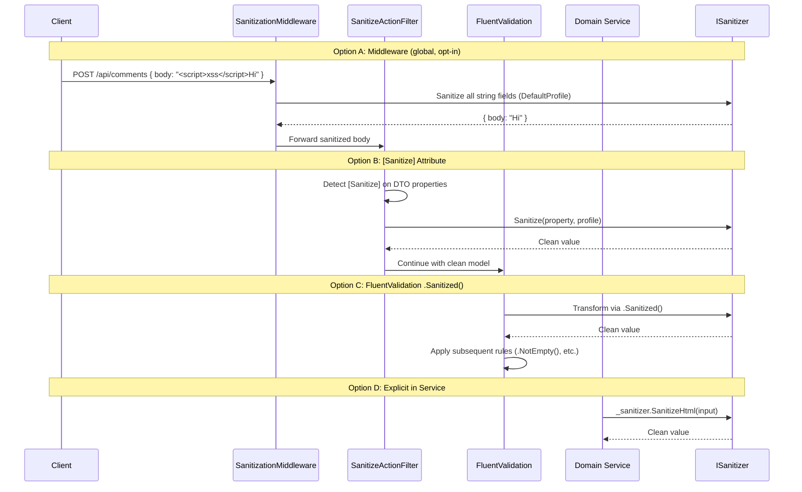

# Design Document: Input Sanitization

## Overview

The Input Sanitization module (`Pervaxis.Genesis.Sanitization`) provides server-side input sanitization to prevent stored/reflected XSS at the service layer. It uses the battle-tested `Ganss.Xss.HtmlSanitizer` library under the hood with a whitelist-based approach (only explicitly allowed tags/attributes pass through).

The module follows existing Genesis patterns:
- **Standard DI registration** via `AddGenesisSanitization` extension methods
- **Options validation** extending `GenesisOptionsBase`
- **Observability** via `PervaxisMeter` and `ILogger<T>` with source-generated `LoggerMessage`
- **Multiple integration points** — explicit service call, `[Sanitize]` attribute, FluentValidation extensions, optional middleware

### Design Rationale

1. **Whitelist-based sanitization** — Only explicitly allowed tags/attributes pass through. This is safe-by-default; unknown elements are stripped. Never use regex-based or blacklist-based sanitization.
2. **Profile-as-class (not enum)** — `SanitizationProfile` is a sealed class with static built-in instances. This allows custom profiles from configuration to sit alongside built-ins without a separate code path.
3. **Pre-configured HtmlSanitizer instances** — One immutable `HtmlSanitizer` instance per profile, created at startup and reused. This avoids thread-safety issues with mutable sanitizer state and eliminates per-request allocation.
4. **Sanitize-then-validate ordering** — The `[Sanitize]` attribute and `.Sanitized()` FluentValidation extension both transform before validation. This means validation rules operate on clean data. The `.MustBeSanitized()` alternative rejects instead of transforms, for teams that want strict validation posture.
5. **Middleware is opt-in** — Global auto-sanitization is powerful but can break legitimate inputs (code snippets, APIs storing raw HTML intentionally). Off by default with per-route exclusions.
6. **Fail-safe on null/empty** — All sanitization methods return null/empty unchanged. No allocation for clean-path inputs.

## Architecture

```mermaid
graph TB
    subgraph "ASP.NET Core Pipeline"
        A[HTTP Request] --> B{Middleware Enabled?}
        B -->|Yes| C[SanitizationMiddleware]
        C --> D{Route Excluded?}
        D -->|Yes| E[Next Middleware]
        D -->|No| F[Deserialize Body]
        F --> G[Sanitize String Fields]
        G --> H[Replace Body Stream]
        H --> E
        B -->|No| E
        E --> I[Model Binding]
        I --> J{Has [Sanitize] Attributes?}
        J -->|Yes| K[SanitizeActionFilter]
        K --> L[Sanitize Decorated Properties]
        J -->|No| M[Continue Pipeline]
        L --> M
        M --> N[FluentValidation]
        N --> O[Controller Action]
        O --> P[Explicit ISanitizer Calls]
    end

    subgraph "Pervaxis.Genesis.Sanitization"
        Q[ISanitizer]
        R[GenesisSanitizer]
        S[SanitizationOptions]
        T[SanitizationProfile]
        U[SanitizeAttribute]
        V[SanitizationMiddleware]
        W[FluentValidation Extensions]
        X[SanitizationMetrics]
        Y[SanitizationLogMessages]
        Z[ProfileRegistry]
    end

    subgraph "External"
        AA[Ganss.Xss.HtmlSanitizer]
    end

    R --> AA
    R --> Z
    Z --> T
    Q -.-> R
```

### Integration Points Flow



## Components and Interfaces

### Project Structure

```
src/Pervaxis.Genesis.Sanitization/
├── Abstractions/
│   ├── ISanitizer.cs
│   └── SanitizationProfile.cs
├── Options/
│   ├── SanitizationOptions.cs
│   └── CustomProfileDefinition.cs
├── Extensions/
│   ├── SanitizationServiceCollectionExtensions.cs
│   ├── SanitizationApplicationBuilderExtensions.cs
│   └── SanitizationRuleBuilderExtensions.cs
├── Services/
│   ├── GenesisSanitizer.cs
│   └── ProfileRegistry.cs
├── Filters/
│   ├── SanitizeAttribute.cs
│   └── SanitizeActionFilter.cs
├── Middleware/
│   └── SanitizationMiddleware.cs
├── Diagnostics/
│   ├── SanitizationMetrics.cs
│   └── SanitizationLogMessages.cs
└── Pervaxis.Genesis.Sanitization.csproj

tests/Pervaxis.Genesis.Sanitization.Tests/
├── Services/
│   ├── GenesisSanitizerTests.cs
│   └── ProfileRegistryTests.cs
├── Options/
│   └── SanitizationOptionsTests.cs
├── Filters/
│   └── SanitizeActionFilterTests.cs
├── Middleware/
│   └── SanitizationMiddlewareTests.cs
├── FluentValidation/
│   └── SanitizationRuleBuilderExtensionsTests.cs
├── Security/
│   └── XssBypassTests.cs
└── Registration/
    └── ServiceCollectionExtensionsTests.cs
```

### Core Interfaces

```csharp
namespace Pervaxis.Genesis.Sanitization.Abstractions;

/// <summary>
/// Primary abstraction for input sanitization operations.
/// All implementations must be thread-safe for concurrent calls.
/// </summary>
public interface ISanitizer
{
    /// <summary>
    /// Strips ALL HTML tags and script content — returns plain text only.
    /// Decodes HTML entities in the output.
    /// </summary>
    /// <param name="input">The input string to sanitize. Null/empty returns unchanged.</param>
    /// <returns>Plain text with all HTML removed.</returns>
    string? StripAll(string? input);

    /// <summary>
    /// Allows safe HTML (bold, italic, links, lists) — strips scripts, event handlers, iframes.
    /// Uses the SafeHtml built-in profile.
    /// </summary>
    /// <param name="input">The input string to sanitize. Null/empty returns unchanged.</param>
    /// <returns>HTML with only safe elements preserved.</returns>
    string? SanitizeHtml(string? input);

    /// <summary>
    /// Applies sanitization using the specified profile instance.
    /// </summary>
    /// <param name="input">The input string to sanitize. Null/empty returns unchanged.</param>
    /// <param name="profile">The sanitization profile defining allowed elements.</param>
    /// <returns>Sanitized string per profile rules.</returns>
    string? Sanitize(string? input, SanitizationProfile profile);

    /// <summary>
    /// Applies sanitization using a named profile from the registry.
    /// </summary>
    /// <param name="input">The input string to sanitize. Null/empty returns unchanged.</param>
    /// <param name="profileName">The registered profile name.</param>
    /// <returns>Sanitized string per profile rules.</returns>
    /// <exception cref="ArgumentException">Thrown when profileName is not found in registry.</exception>
    string? Sanitize(string? input, string profileName);
}
```

### SanitizationProfile

```csharp
namespace Pervaxis.Genesis.Sanitization.Abstractions;

/// <summary>
/// Defines a sanitization profile with allowed tags, attributes, and URL schemes.
/// Built-in profiles are exposed as static readonly instances.
/// </summary>
public sealed class SanitizationProfile
{
    public static readonly SanitizationProfile PlainText = new("PlainText")
    {
        AllowedTags = ImmutableHashSet<string>.Empty,
        AllowedAttributes = ImmutableDictionary<string, ImmutableHashSet<string>>.Empty,
        AllowedUrlSchemes = ImmutableHashSet<string>.Empty
    };

    public static readonly SanitizationProfile SafeHtml = new("SafeHtml")
    {
        AllowedTags = ImmutableHashSet.Create(StringComparer.OrdinalIgnoreCase,
            "b", "i", "strong", "em", "a", "ul", "ol", "li", "p", "br", "span"),
        AllowedAttributes = ImmutableDictionary.CreateRange(StringComparer.OrdinalIgnoreCase,
            new[] { KeyValuePair.Create("a", ImmutableHashSet.Create(StringComparer.OrdinalIgnoreCase, "href")) }),
        AllowedUrlSchemes = ImmutableHashSet.Create(StringComparer.OrdinalIgnoreCase,
            "http", "https", "mailto")
    };

    public static readonly SanitizationProfile Markdown = new("Markdown")
    {
        AllowedTags = ImmutableHashSet.Create(StringComparer.OrdinalIgnoreCase,
            "b", "i", "strong", "em", "a", "ul", "ol", "li", "p", "br", "span",
            "code", "pre", "h1", "h2", "h3", "h4", "h5", "h6", "blockquote",
            "table", "thead", "tbody", "tr", "th", "td", "img", "hr", "dl", "dt", "dd"),
        AllowedAttributes = ImmutableDictionary.CreateRange(StringComparer.OrdinalIgnoreCase,
            new[]
            {
                KeyValuePair.Create("a", ImmutableHashSet.Create(StringComparer.OrdinalIgnoreCase, "href")),
                KeyValuePair.Create("img", ImmutableHashSet.Create(StringComparer.OrdinalIgnoreCase, "src", "alt")),
                KeyValuePair.Create("code", ImmutableHashSet.Create(StringComparer.OrdinalIgnoreCase, "class")),
                KeyValuePair.Create("pre", ImmutableHashSet.Create(StringComparer.OrdinalIgnoreCase, "class"))
            }),
        AllowedUrlSchemes = ImmutableHashSet.Create(StringComparer.OrdinalIgnoreCase,
            "http", "https")
    };

    public string Name { get; }
    public ImmutableHashSet<string> AllowedTags { get; init; } = ImmutableHashSet<string>.Empty;
    public ImmutableDictionary<string, ImmutableHashSet<string>> AllowedAttributes { get; init; }
        = ImmutableDictionary<string, ImmutableHashSet<string>>.Empty;
    public ImmutableHashSet<string> AllowedUrlSchemes { get; init; } = ImmutableHashSet<string>.Empty;

    public SanitizationProfile(string name)
    {
        ArgumentException.ThrowIfNullOrWhiteSpace(name);
        Name = name;
    }
}
```

### SanitizationOptions

```csharp
namespace Pervaxis.Genesis.Sanitization.Options;

/// <summary>
/// Configuration for the Genesis Sanitization module.
/// Bound from "Genesis:Sanitization" configuration section.
/// </summary>
public sealed class SanitizationOptions : GenesisOptionsBase
{
    /// <summary>Default profile name. Default: "PlainText".</summary>
    public string DefaultProfile { get; set; } = "PlainText";

    /// <summary>Whether custom profiles from config are loaded. Default: true.</summary>
    public bool AllowCustomProfiles { get; set; } = true;

    /// <summary>Custom profile definitions keyed by name.</summary>
    public Dictionary<string, CustomProfileDefinition> CustomProfiles { get; set; } = new();

    /// <summary>Maximum input string length. Default: 1,000,000. Range: 1-10,000,000.</summary>
    public int MaxInputLength { get; set; } = 1_000_000;

    /// <summary>Enable global sanitization middleware. Default: false.</summary>
    public bool EnableMiddleware { get; set; } = false;

    /// <summary>Route patterns excluded from middleware sanitization.</summary>
    public List<string> MiddlewareExcludedRoutes { get; set; } = new();

    public override bool Validate()
    {
        if (!base.Validate()) return false;
        if (string.IsNullOrEmpty(DefaultProfile)) return false;
        if (MaxInputLength < 1 || MaxInputLength > 10_000_000) return false;
        // DefaultProfile must match a known profile — checked at registration time
        return true;
    }
}
```

### CustomProfileDefinition

```csharp
namespace Pervaxis.Genesis.Sanitization.Options;

/// <summary>
/// Defines a custom sanitization profile via configuration.
/// </summary>
public sealed class CustomProfileDefinition
{
    /// <summary>Unique profile name.</summary>
    public required string Name { get; set; }

    /// <summary>HTML tags allowed by this profile.</summary>
    public List<string> AllowedTags { get; set; } = new();

    /// <summary>Attributes allowed per tag (tag → list of attribute names).</summary>
    public Dictionary<string, List<string>> AllowedAttributes { get; set; } = new();

    /// <summary>URL schemes allowed in URL-accepting attributes.</summary>
    public List<string> AllowedUrlSchemes { get; set; } = new() { "http", "https" };
}
```

### ProfileRegistry

```csharp
namespace Pervaxis.Genesis.Sanitization.Services;

/// <summary>
/// Registry of sanitization profiles and their pre-configured HtmlSanitizer instances.
/// Populated at startup, immutable after initialization.
/// </summary>
internal sealed class ProfileRegistry
{
    private readonly ImmutableDictionary<string, (SanitizationProfile Profile, HtmlSanitizer Sanitizer)> _profiles;

    /// <summary>
    /// Gets the profile and its configured sanitizer by name.
    /// </summary>
    /// <exception cref="ArgumentException">Thrown when profileName is not registered.</exception>
    public (SanitizationProfile Profile, HtmlSanitizer Sanitizer) Get(string profileName);

    /// <summary>
    /// Gets the profile and sanitizer for a profile instance (by name lookup).
    /// </summary>
    public (SanitizationProfile Profile, HtmlSanitizer Sanitizer) Get(SanitizationProfile profile);

    /// <summary>
    /// Checks whether a profile name is registered.
    /// </summary>
    public bool Contains(string profileName);
}
```

### SanitizeAttribute

```csharp
namespace Pervaxis.Genesis.Sanitization.Filters;

/// <summary>
/// Declaratively sanitizes a string property at model binding time.
/// Processed by SanitizeActionFilter before validation runs.
/// </summary>
[AttributeUsage(AttributeTargets.Property, AllowMultiple = false)]
public sealed class SanitizeAttribute : Attribute
{
    /// <summary>
    /// Profile name to use. Null means use DefaultProfile from options.
    /// </summary>
    public string? Profile { get; set; }
}
```

### FluentValidation Extensions

```csharp
namespace Pervaxis.Genesis.Sanitization.Extensions;

/// <summary>
/// FluentValidation extensions for input sanitization.
/// </summary>
public static class SanitizationRuleBuilderExtensions
{
    /// <summary>
    /// Transforms the property value by sanitizing with the default profile.
    /// Subsequent rules operate on the sanitized value.
    /// </summary>
    public static IRuleBuilderOptions<T, string> Sanitized<T>(
        this IRuleBuilder<T, string> ruleBuilder);

    /// <summary>
    /// Transforms the property value by sanitizing with the named profile.
    /// </summary>
    public static IRuleBuilderOptions<T, string> Sanitized<T>(
        this IRuleBuilder<T, string> ruleBuilder, string profileName);

    /// <summary>
    /// Transforms the property value by sanitizing with the specified profile.
    /// </summary>
    public static IRuleBuilderOptions<T, string> Sanitized<T>(
        this IRuleBuilder<T, string> ruleBuilder, SanitizationProfile profile);

    /// <summary>
    /// Validates that the input does NOT contain content that would be stripped.
    /// Fails validation (does not transform) if dangerous content is detected.
    /// </summary>
    public static IRuleBuilderOptions<T, string> MustBeSanitized<T>(
        this IRuleBuilder<T, string> ruleBuilder);

    /// <summary>
    /// Validates against a named profile — fails if content would be stripped.
    /// </summary>
    public static IRuleBuilderOptions<T, string> MustBeSanitized<T>(
        this IRuleBuilder<T, string> ruleBuilder, string profileName);
}
```

## Data Models

### Configuration Schema (appsettings.json)

```json
{
  "Genesis": {
    "Sanitization": {
      "DefaultProfile": "PlainText",
      "AllowCustomProfiles": true,
      "MaxInputLength": 1000000,
      "EnableMiddleware": false,
      "MiddlewareExcludedRoutes": [
        "/api/admin/templates/*",
        "/api/webhooks/*"
      ],
      "CustomProfiles": {
        "RichContent": {
          "Name": "RichContent",
          "AllowedTags": ["b", "i", "strong", "em", "a", "p", "br", "img", "h1", "h2", "h3"],
          "AllowedAttributes": {
            "a": ["href", "title"],
            "img": ["src", "alt", "width", "height"]
          },
          "AllowedUrlSchemes": ["http", "https"]
        }
      }
    }
  }
}
```

## Correctness Properties

### Property 1: Options Validation Correctness

*For any* `SanitizationOptions` instance, `Validate()` SHALL return true if and only if: DefaultProfile is non-empty, MaxInputLength is in [1, 10_000_000], and no custom profile name conflicts with a built-in name. Conversely, *for any* options instance violating any constraint, `Validate()` SHALL return false.

**Validates: Requirements 2.8, 2.9, 2.10, 2.11, 2.12**

### Property 2: Null/Empty Input Passthrough

*For any* null or empty string input and *any* sanitization method (`StripAll`, `SanitizeHtml`, `Sanitize`), the output SHALL be identical to the input (null → null, "" → "").

**Validates: Requirements 3.5, 3.6, 3.7**

### Property 3: PlainText Idempotence

*For any* input string, applying `StripAll` twice SHALL produce the same result as applying it once. Additionally, the output of `StripAll` SHALL never contain any `<` or `>` characters (no HTML tags remain).

**Validates: Requirement 4.1**

### Property 4: SafeHtml Preserves Allowed Content

*For any* input string containing ONLY tags from the SafeHtml allowed set with only `href` on anchors (and valid URL schemes), `SanitizeHtml` SHALL return the input unchanged. *For any* input containing `<script>`, `<iframe>`, `on*` attributes, or `javascript:` URLs, the output SHALL NOT contain those elements.

**Validates: Requirements 4.3, 4.4, 4.5, 4.6, 4.7**

### Property 5: Profile Isolation

*For any* two distinct profiles P1 and P2, sanitizing the same input with P1 and P2 SHALL produce independently correct results — P1's allowed tags SHALL NOT influence P2's behavior and vice versa.

**Validates: Requirements 5.1, 5.3**

### Property 6: Thread Safety

*For any* set of concurrent sanitization calls (N ≥ 100) on the same ISanitizer instance with the same profile and input, all results SHALL be identical and no exceptions SHALL be thrown.

**Validates: Requirement 3.10**

### Property 7: XSS Vector Resistance

*For any* input from the OWASP XSS Filter Evasion Cheat Sheet vectors, `StripAll` SHALL return plain text with no executable content, and `SanitizeHtml` SHALL return HTML with no script execution vectors.

**Validates: Requirements 11.1-11.7**

## Error Handling

### Error Scenarios

| Scenario | Behavior |
|----------|----------|
| Input exceeds MaxInputLength | `ArgumentException` thrown |
| Unknown profile name in `Sanitize(input, profileName)` | `ArgumentException` thrown |
| Custom profile name conflicts with built-in at startup | `InvalidOperationException` thrown |
| `[Sanitize]` references unknown profile | `InvalidOperationException` → HTTP 500 |
| Middleware can't parse JSON body | Pass through unmodified |
| Null/empty input | Return unchanged (no-op) |

### No Fail-Open Required

Unlike the Idempotency module, sanitization has no external dependencies (no network calls, no stores). The HtmlSanitizer library operates entirely in-memory. There is no failure mode that requires a fail-open strategy — if sanitization itself throws an unexpected exception, it should propagate as a 500 to prevent unsanitized content from being processed.

## Testing Strategy

### Unit Tests (xUnit + NSubstitute + FluentAssertions)

- `GenesisSanitizerTests` — Core sanitization behavior for all profiles
- `ProfileRegistryTests` — Profile registration, lookup, custom profile loading
- `SanitizationOptionsTests` — Options validation boundary cases
- `SanitizeActionFilterTests` — Attribute processing order and behavior
- `SanitizationMiddlewareTests` — Route matching, body replacement, exclusions
- `SanitizationRuleBuilderExtensionsTests` — FluentValidation transform and validate modes
- `ServiceCollectionExtensionsTests` — DI registration, null guards, idempotency

### Security Tests

- `XssBypassTests` — OWASP XSS Filter Evasion Cheat Sheet vectors (30+ test cases)
- Nested encoding attacks
- Case variation attacks
- Null byte injection
- SVG/MathML vectors
- CSS expression attacks
- Unicode normalization attacks

### Test Dependencies

- `xUnit` — test framework
- `FluentAssertions` — assertion library
- `NSubstitute` — mocking library
- `Microsoft.AspNetCore.Mvc.Testing` — for middleware integration tests

## Dependencies

### NuGet Packages

| Package | Version | Purpose |
|---------|---------|---------|
| `HtmlSanitizer` (Ganss.Xss) | Latest stable | Core sanitization engine |
| `FluentValidation` | Latest stable | FluentValidation extensions |
| `Microsoft.AspNetCore.App` (FrameworkReference) | — | ASP.NET Core primitives |
| `Pervaxis.Genesis.Base` (ProjectReference) | — | GenesisOptionsBase, PervaxisMeter |
