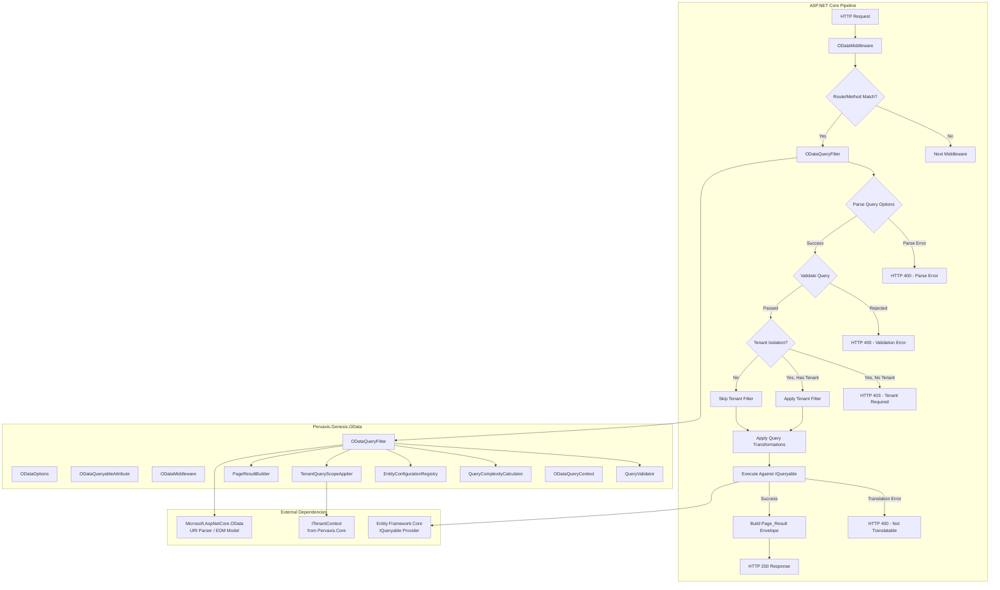
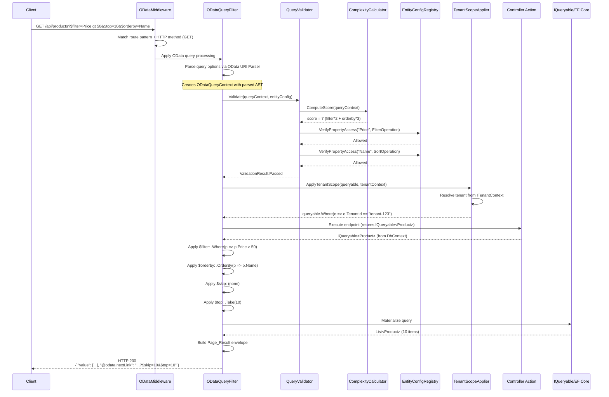

# Design Document: OData REST Support

## Overview

The OData REST Support module (`Pervaxis.Genesis.OData`) provides standardized OData query capabilities for REST API endpoints within the Pervaxis Genesis platform. It enables clients to use OData system query options (`$filter`, `$orderby`, `$select`, `$expand`, `$top`, `$skip`, `$count`) against API endpoints, translating these into efficient LINQ expression tree transformations against Entity Framework Core and other `IQueryable<T>` providers.

Unlike other Genesis modules that follow the Abstraction + AWS split pattern, OData support is purely an ASP.NET Core middleware/library concern — it operates entirely in-process on `IQueryable<T>` data sources and does not require an AWS-specific implementation project.

The module follows existing Genesis conventions:
- **Standard DI registration** via `AddGenesisOData` extension methods
- **Options validation** extending `GenesisOptionsBase`
- **Observability** via `PervaxisMeter`, `PervaxisActivitySource`, and `ILogger<T>` with source-generated `LoggerMessage`
- **Multi-tenancy** via `ITenantContext` for automatic tenant scoping
- **Opt-in** via `[ODataQueryable]` attribute or middleware route patterns
- **Security** via configurable query complexity limits and per-entity property access control

### Design Rationale

1. **Wrapping Microsoft.AspNetCore.OData** — Rather than implementing OData parsing from scratch, the module delegates to Microsoft's official OData library for query parsing and uses its URI parser, EDM model, and query option handling. This ensures spec-compliant parsing while letting Genesis add validation, security, observability, and multi-tenancy layers.
2. **IQueryable-first approach** — The module operates on `IQueryable<T>` expression trees, allowing EF Core (or any LINQ provider) to translate the combined query to efficient SQL. This avoids materializing large datasets in memory.
3. **Security-by-default with opt-out** — All query limits are enforced by default (MaxTop, MaxExpandDepth, MaxFilterDepth, complexity scoring). Developers must explicitly relax limits rather than accidentally exposing unbounded queries.
4. **Attribute + Middleware dual opt-in** — Mirrors the idempotency module pattern. Developers can selectively enable OData on individual actions (attribute) or apply it broadly to route groups (middleware). Attribute settings override middleware defaults.
5. **Entity configuration for property access control** — Rather than exposing all entity properties to OData queries, developers explicitly configure which properties are filterable, sortable, selectable, and expandable. This prevents clients from querying sensitive fields or triggering expensive joins.

## Architecture



### Request Flow Sequence



## Components and Interfaces

### Project Structure

```
src/Pervaxis.Genesis.OData/
├── Abstractions/
│   ├── IEntityODataConfiguration.cs
│   ├── IQueryValidator.cs
│   ├── IQueryComplexityCalculator.cs
│   ├── ITenantQueryScopeApplier.cs
│   └── IPageResultBuilder.cs
├── Configuration/
│   ├── EntityODataConfiguration.cs
│   ├── EntityConfigurationRegistry.cs
│   └── EntityPropertyDescriptor.cs
├── Options/
│   ├── ODataOptions.cs
│   ├── ODataMiddlewareOptions.cs
│   └── ODataQueryOptions.cs (flags enum)
├── Extensions/
│   ├── ODataServiceCollectionExtensions.cs
│   └── ODataApplicationBuilderExtensions.cs
├── Filters/
│   ├── ODataQueryableAttribute.cs
│   └── ODataQueryFilter.cs
├── Middleware/
│   └── ODataMiddleware.cs
├── Services/
│   ├── QueryValidator.cs
│   ├── QueryComplexityCalculator.cs
│   ├── TenantQueryScopeApplier.cs
│   ├── PageResultBuilder.cs
│   └── ODataQueryContext.cs
├── Diagnostics/
│   ├── ODataMetrics.cs
│   ├── ODataTracing.cs
│   └── ODataLogMessages.cs
├── Results/
│   └── PageResult.cs
└── Pervaxis.Genesis.OData.csproj
```

### Core Interfaces

```csharp
namespace Pervaxis.Genesis.OData.Abstractions;

/// <summary>
/// Validates OData query options against configured limits and entity property access rules.
/// </summary>
public interface IQueryValidator
{
    /// <summary>
    /// Validates the parsed OData query context against global/per-endpoint limits
    /// and entity property access configuration.
    /// </summary>
    /// <returns>Validation result with error details if rejected.</returns>
    QueryValidationResult Validate(
        ODataQueryContext queryContext,
        EntityPropertyDescriptor entityDescriptor,
        EffectiveQueryLimits limits);
}

/// <summary>
/// Computes the complexity score of an OData query based on configured formula.
/// </summary>
public interface IQueryComplexityCalculator
{
    /// <summary>
    /// Computes complexity score: filters*2 + expandDepth*10 + orderbyProps*3 + (count?5:0) + max(0, selectProps-5).
    /// </summary>
    int ComputeScore(ODataQueryContext queryContext);
}

/// <summary>
/// Applies tenant isolation filter as the outermost Where clause on an IQueryable.
/// </summary>
public interface ITenantQueryScopeApplier
{
    /// <summary>
    /// Applies tenant scoping to the queryable. Returns a scoped queryable or a failure result
    /// if tenant context is required but not available.
    /// </summary>
    TenantScopeResult<T> ApplyScope<T>(
        IQueryable<T> queryable,
        EntityPropertyDescriptor entityDescriptor) where T : class;
}

/// <summary>
/// Builds the OData Page_Result response envelope from query results.
/// </summary>
public interface IPageResultBuilder
{
    /// <summary>
    /// Constructs the Page_Result response with value, @odata.count, @odata.nextLink, and @odata.context.
    /// </summary>
    PageResult<T> Build<T>(
        IReadOnlyList<T> items,
        long? totalCount,
        ODataQueryContext queryContext,
        EffectiveQueryLimits limits,
        HttpRequest request) where T : class;
}
```

### Entity Configuration Interface

```csharp
namespace Pervaxis.Genesis.OData.Abstractions;

/// <summary>
/// Fluent configuration interface for defining OData query permissions per entity type.
/// </summary>
public interface IEntityODataConfiguration<TEntity> where TEntity : class
{
    /// <summary>
    /// Marks a property as filterable (allowed in $filter expressions).
    /// </summary>
    IEntityODataConfiguration<TEntity> ConfigureFilter(
        Expression<Func<TEntity, object>> propertyExpression);

    /// <summary>
    /// Marks a property as sortable (allowed in $orderby expressions).
    /// </summary>
    IEntityODataConfiguration<TEntity> ConfigureSort(
        Expression<Func<TEntity, object>> propertyExpression);

    /// <summary>
    /// Marks a property as selectable (allowed in $select expressions).
    /// </summary>
    IEntityODataConfiguration<TEntity> ConfigureSelect(
        Expression<Func<TEntity, object>> propertyExpression);

    /// <summary>
    /// Marks a navigation property as expandable (allowed in $expand expressions).
    /// </summary>
    IEntityODataConfiguration<TEntity> ConfigureExpand(
        Expression<Func<TEntity, object>> propertyExpression);

    /// <summary>
    /// Excludes a property from all OData query operations.
    /// Excluded properties are hidden from $select and rejected from $filter/$orderby/$expand.
    /// </summary>
    IEntityODataConfiguration<TEntity> ExcludeProperty(
        Expression<Func<TEntity, object>> propertyExpression);

    /// <summary>
    /// Configures the tenant property for this entity type (overrides convention-based detection).
    /// </summary>
    IEntityODataConfiguration<TEntity> ConfigureTenantProperty(
        Expression<Func<TEntity, string>> propertyExpression);
}
```

### ODataQueryable Attribute

```csharp
namespace Pervaxis.Genesis.OData.Filters;

/// <summary>
/// Enables OData query processing on a controller action.
/// Per-endpoint configuration overrides global ODataOptions settings.
/// </summary>
[AttributeUsage(AttributeTargets.Method, AllowMultiple = false)]
public sealed class ODataQueryableAttribute : Attribute, IFilterFactory
{
    /// <summary>
    /// Per-endpoint $top maximum override. 0 means use global ODataOptions.MaxTop.
    /// Valid range when non-zero: 1-10000.
    /// </summary>
    public int MaxTop { get; set; } = 0;

    /// <summary>
    /// Per-endpoint $expand depth override. -1 means use global ODataOptions.MaxExpandDepth.
    /// Valid range when non-negative: 0-5.
    /// </summary>
    public int MaxExpandDepth { get; set; } = -1;

    /// <summary>
    /// Per-endpoint allowed query options override.
    /// Default: ODataQueryOptions.All (use global setting).
    /// </summary>
    public ODataQueryOptions AllowedQueryOptions { get; set; } = ODataQueryOptions.All;

    public bool IsReusable => true;

    public IFilterMetadata CreateInstance(IServiceProvider serviceProvider)
        => serviceProvider.GetRequiredService<ODataQueryFilter>();
}
```

### Query Complexity Calculator

```csharp
namespace Pervaxis.Genesis.OData.Services;

/// <summary>
/// Computes query complexity using the formula:
///   filterConditions * 2 + expandDepth * 10 + orderByProperties * 3 + (count ? 5 : 0) + max(0, selectProperties - 5)
/// </summary>
public sealed class QueryComplexityCalculator : IQueryComplexityCalculator
{
    public int ComputeScore(ODataQueryContext queryContext)
    {
        var score = 0;
        score += queryContext.FilterConditionCount * 2;
        score += queryContext.ExpandDepth * 10;
        score += queryContext.OrderByPropertyCount * 3;
        score += queryContext.CountRequested ? 5 : 0;
        score += Math.Max(0, queryContext.SelectPropertyCount - 5);
        return score;
    }
}
```

### Middleware Options

```csharp
namespace Pervaxis.Genesis.OData.Options;

/// <summary>
/// Configuration for the OData middleware route/method targeting.
/// </summary>
public sealed class ODataMiddlewareOptions
{
    /// <summary>
    /// Route patterns to enable OData processing on (e.g., "/api/products", "/api/orders/{id}/items").
    /// Supports literal segments and {parameter} placeholders.
    /// </summary>
    public List<string> RoutePatterns { get; set; } = new();

    /// <summary>
    /// HTTP methods to apply OData processing to. Default: GET only.
    /// </summary>
    public HashSet<string> AllowedMethods { get; set; } = new(StringComparer.OrdinalIgnoreCase)
    {
        "GET"
    };
}
```

### Query Options Flags Enum

```csharp
namespace Pervaxis.Genesis.OData.Options;

/// <summary>
/// Flags enum representing supported OData query options.
/// Used for enabling/disabling specific options globally or per-endpoint.
/// </summary>
[Flags]
public enum ODataQueryOptions
{
    None = 0,
    Filter = 1,
    OrderBy = 2,
    Select = 4,
    Expand = 8,
    Top = 16,
    Skip = 32,
    Count = 64,
    All = Filter | OrderBy | Select | Expand | Top | Skip | Count
}
```

## Data Models

### ODataOptions

```csharp
namespace Pervaxis.Genesis.OData.Options;

/// <summary>
/// Configuration for the Genesis OData module.
/// Bound from "Genesis:OData" configuration section.
/// </summary>
public sealed class ODataOptions : GenesisOptionsBase
{
    /// <summary>Maximum allowed $top value. Default: 100. Range: 1-10000.</summary>
    public int MaxTop { get; set; } = 100;

    /// <summary>Default page size when $top not specified. Default: 20. Range: 1-MaxTop.</summary>
    public int DefaultPageSize { get; set; } = 20;

    /// <summary>Maximum $expand nesting depth. Default: 2. Range: 0-5.</summary>
    public int MaxExpandDepth { get; set; } = 2;

    /// <summary>Maximum $filter logical operator nesting depth. Default: 3. Range: 1-10.</summary>
    public int MaxFilterDepth { get; set; } = 3;

    /// <summary>Maximum properties in $orderby. Default: 3. Range: 1-10.</summary>
    public int MaxOrderByProperties { get; set; } = 3;

    /// <summary>Enable tenant-scoped query isolation. Default: true.</summary>
    public bool EnableTenantIsolation { get; set; } = true;

    /// <summary>Enable $count query option. Default: true.</summary>
    public bool EnableCount { get; set; } = true;

    /// <summary>Maximum query complexity score. Default: 50. Range: 1-200.</summary>
    public int MaxQueryComplexityScore { get; set; } = 50;

    /// <summary>Allowed query options (flags). Default: All.</summary>
    public ODataQueryOptions AllowedQueryOptions { get; set; } = ODataQueryOptions.All;

    /// <summary>
    /// Validates the OData options configuration.
    /// </summary>
    public override bool Validate()
    {
        if (!base.Validate()) return false;
        if (MaxTop < 1 || MaxTop > 10000) return false;
        if (DefaultPageSize < 1 || DefaultPageSize > MaxTop) return false;
        if (MaxExpandDepth < 0 || MaxExpandDepth > 5) return false;
        if (MaxFilterDepth < 1 || MaxFilterDepth > 10) return false;
        if (MaxOrderByProperties < 1 || MaxOrderByProperties > 10) return false;
        if (MaxQueryComplexityScore < 1 || MaxQueryComplexityScore > 200) return false;
        return true;
    }
}
```

### ODataQueryContext

```csharp
namespace Pervaxis.Genesis.OData.Services;

/// <summary>
/// Per-request context containing parsed OData query options and computed metadata.
/// Created by the OData URI parser from the raw query string.
/// </summary>
public sealed class ODataQueryContext
{
    /// <summary>Parsed $filter AST (null if not provided).</summary>
    public FilterClause? Filter { get; init; }

    /// <summary>Parsed $orderby clause (null if not provided).</summary>
    public OrderByClause? OrderBy { get; init; }

    /// <summary>List of $select property paths (empty if not provided).</summary>
    public IReadOnlyList<string> SelectProperties { get; init; } = Array.Empty<string>();

    /// <summary>Parsed $expand tree (empty if not provided).</summary>
    public IReadOnlyList<ExpandItem> ExpandItems { get; init; } = Array.Empty<ExpandItem>();

    /// <summary>Effective $top value (client-provided or DefaultPageSize).</summary>
    public int EffectiveTop { get; init; }

    /// <summary>$skip value (0 if not provided).</summary>
    public int Skip { get; init; }

    /// <summary>Whether $count=true was requested.</summary>
    public bool CountRequested { get; init; }

    /// <summary>Number of filter conditions (for complexity scoring).</summary>
    public int FilterConditionCount { get; init; }

    /// <summary>Maximum $expand nesting depth (for complexity scoring).</summary>
    public int ExpandDepth { get; init; }

    /// <summary>Number of $orderby properties (for complexity scoring).</summary>
    public int OrderByPropertyCount { get; init; }

    /// <summary>Number of $select properties (for complexity scoring).</summary>
    public int SelectPropertyCount { get; init; }

    /// <summary>Computed complexity score.</summary>
    public int ComplexityScore { get; set; }

    /// <summary>Set of query options used in this request (for tracing/metrics).</summary>
    public ODataQueryOptions UsedOptions { get; init; }

    /// <summary>Raw query string for logging/diagnostics.</summary>
    public string RawQueryString { get; init; } = string.Empty;
}
```

### PageResult

```csharp
namespace Pervaxis.Genesis.OData.Results;

/// <summary>
/// Standardized OData response envelope containing query results and pagination metadata.
/// Serialized with OData JSON conventions (@odata.count, @odata.nextLink, @odata.context).
/// </summary>
public sealed class PageResult<T> where T : class
{
    /// <summary>The array of result items.</summary>
    [JsonPropertyName("value")]
    public IReadOnlyList<T> Value { get; init; } = Array.Empty<T>();

    /// <summary>Total count of matching items (before paging). Null when $count not requested.</summary>
    [JsonPropertyName("@odata.count")]
    [JsonIgnore(Condition = JsonIgnoreCondition.WhenWritingNull)]
    public long? Count { get; init; }

    /// <summary>URL for the next page. Null when no more pages available.</summary>
    [JsonPropertyName("@odata.nextLink")]
    [JsonIgnore(Condition = JsonIgnoreCondition.WhenWritingNull)]
    public string? NextLink { get; init; }

    /// <summary>OData context metadata URL.</summary>
    [JsonPropertyName("@odata.context")]
    public string Context { get; init; } = string.Empty;
}
```

### EntityPropertyDescriptor

```csharp
namespace Pervaxis.Genesis.OData.Configuration;

/// <summary>
/// Describes the OData query permissions for all properties of a given entity type.
/// Built from IEntityODataConfiguration or default conventions.
/// </summary>
public sealed class EntityPropertyDescriptor
{
    /// <summary>Entity CLR type.</summary>
    public Type EntityType { get; init; } = null!;

    /// <summary>Properties allowed in $filter expressions.</summary>
    public IReadOnlySet<string> FilterableProperties { get; init; } = new HashSet<string>();

    /// <summary>Properties allowed in $orderby expressions.</summary>
    public IReadOnlySet<string> SortableProperties { get; init; } = new HashSet<string>();

    /// <summary>Properties allowed in $select expressions.</summary>
    public IReadOnlySet<string> SelectableProperties { get; init; } = new HashSet<string>();

    /// <summary>Navigation properties allowed in $expand expressions.</summary>
    public IReadOnlySet<string> ExpandableProperties { get; init; } = new HashSet<string>();

    /// <summary>Properties excluded from all operations.</summary>
    public IReadOnlySet<string> ExcludedProperties { get; init; } = new HashSet<string>();

    /// <summary>Tenant property name (null if no tenant property detected/configured).</summary>
    public string? TenantPropertyName { get; init; }

    /// <summary>Whether this entity has a configured/detected tenant property.</summary>
    public bool HasTenantProperty => TenantPropertyName is not null;
}
```

### EffectiveQueryLimits

```csharp
namespace Pervaxis.Genesis.OData.Services;

/// <summary>
/// Resolved query limits for a specific request, combining global options with per-endpoint overrides.
/// </summary>
public sealed class EffectiveQueryLimits
{
    public int MaxTop { get; init; }
    public int DefaultPageSize { get; init; }
    public int MaxExpandDepth { get; init; }
    public int MaxFilterDepth { get; init; }
    public int MaxOrderByProperties { get; init; }
    public int MaxQueryComplexityScore { get; init; }
    public ODataQueryOptions AllowedQueryOptions { get; init; }
    public bool EnableCount { get; init; }
}
```

### QueryValidationResult

```csharp
namespace Pervaxis.Genesis.OData.Services;

/// <summary>
/// Result of query validation. Contains the error code and message when rejected.
/// </summary>
public readonly record struct QueryValidationResult(
    bool IsValid,
    string? ErrorCode,
    string? ErrorMessage,
    string? FailingOption,
    string? FailingValue);
```

### Configuration Schema (appsettings.json)

```json
{
  "Genesis": {
    "OData": {
      "MaxTop": 100,
      "DefaultPageSize": 20,
      "MaxExpandDepth": 2,
      "MaxFilterDepth": 3,
      "MaxOrderByProperties": 3,
      "EnableTenantIsolation": true,
      "EnableCount": true,
      "MaxQueryComplexityScore": 50,
      "AllowedQueryOptions": "All",
      "UseLocalEmulator": false
    }
  }
}
```

## Correctness Properties

*A property is a characteristic or behavior that should hold true across all valid executions of a system — essentially, a formal statement about what the system should do. Properties serve as the bridge between human-readable specifications and machine-verifiable correctness guarantees.*

### Property 1: Options Configuration Round-Trip

*For any* set of valid configuration values (MaxTop 1-10000, DefaultPageSize 1-MaxTop, MaxExpandDepth 0-5, MaxFilterDepth 1-10, MaxOrderByProperties 1-10, MaxQueryComplexityScore 1-200, EnableTenantIsolation bool, EnableCount bool, AllowedQueryOptions flags), binding those values to `ODataOptions` via either `IConfiguration` or `Action<ODataOptions>` SHALL produce an options instance whose properties match the input values exactly.

**Validates: Requirements 1.4, 1.5**

### Property 2: Options Validation Correctness

*For any* `ODataOptions` instance, `Validate()` SHALL return true if and only if: MaxTop is in [1, 10000], DefaultPageSize is in [1, MaxTop], MaxExpandDepth is in [0, 5], MaxFilterDepth is in [1, 10], MaxOrderByProperties is in [1, 10], MaxQueryComplexityScore is in [1, 200], and `base.Validate()` returns true. Conversely, *for any* options instance violating any of these constraints, `Validate()` SHALL return false.

**Validates: Requirements 2.11, 2.12, 2.13, 2.14, 2.15, 2.16, 2.17**

### Property 3: Query Complexity Score Computation

*For any* OData query context with a given number of filter conditions, expand depth, orderby properties, count flag, and select properties, the computed `QueryComplexityScore` SHALL equal: `(filterConditions × 2) + (expandDepth × 10) + (orderByProperties × 3) + (countRequested ? 5 : 0) + max(0, selectProperties − 5)`.

**Validates: Requirements 4.6**

### Property 4: Validation Limit Enforcement

*For any* OData query where: `$top` exceeds `MaxTop`, OR `$expand` depth exceeds `MaxExpandDepth`, OR `$filter` nesting exceeds `MaxFilterDepth`, OR `$orderby` property count exceeds `MaxOrderByProperties`, OR the computed complexity score exceeds `MaxQueryComplexityScore`, the `QueryValidator` SHALL reject the query and return the appropriate error code (`ODATA_TOP_EXCEEDED`, `ODATA_EXPAND_DEPTH_EXCEEDED`, `ODATA_FILTER_DEPTH_EXCEEDED`, `ODATA_ORDERBY_EXCEEDED`, or `ODATA_QUERY_TOO_COMPLEX` respectively). Conversely, *for any* query where all values are within their configured limits, validation SHALL pass.

**Validates: Requirements 4.1, 4.2, 4.3, 4.4, 4.5**

### Property 5: Entity Property Access Control

*For any* entity property and query operation (filter, sort, expand), if the property is not marked as permitted for that operation in the `EntityPropertyDescriptor` (including properties explicitly excluded via `ExcludeProperty`), the `QueryValidator` SHALL reject the query with the appropriate error code (`ODATA_PROPERTY_NOT_FILTERABLE`, `ODATA_PROPERTY_NOT_SORTABLE`, or `ODATA_PROPERTY_NOT_EXPANDABLE`). *For any* excluded property requested in `$select`, it SHALL be omitted from the projection result.

**Validates: Requirements 4.7, 4.8, 4.9, 5.5, 5.6**

### Property 6: $filter Application Correctness

*For any* valid `$filter` expression and any collection of entities, applying the filter to the collection SHALL produce a result set where every item satisfies the filter predicate and no items satisfying the predicate are excluded.

**Validates: Requirements 3.1**

### Property 7: $orderby Sorting Correctness

*For any* valid `$orderby` expression and any collection of entities, applying the ordering SHALL produce a result set that is sorted according to the specified properties and directions (ascending/descending), maintaining stable relative order for items with equal sort keys.

**Validates: Requirements 3.2**

### Property 8: $top and $skip Pagination Correctness

*For any* collection of N items, effective top value T, and skip value S: the result set SHALL contain exactly `min(T, max(0, N − S))` items, starting from index S of the ordered collection. When `$top` is omitted, the effective top SHALL equal `DefaultPageSize`.

**Validates: Requirements 3.5, 3.6, 3.8**

### Property 9: $count Correctness

*For any* query with `$count=true` and `EnableCount=true`, the `@odata.count` value in the response SHALL equal the total number of items matching all filters (including tenant filter) before `$skip` and `$top` are applied. *For any* query where `$count` is not requested or `EnableCount` is false, the `@odata.count` field SHALL be absent from the response.

**Validates: Requirements 3.7, 8.3, 8.4**

### Property 10: Disabled Query Option Rejection

*For any* query option that is not included in the effective `AllowedQueryOptions` flags, using that option in a request SHALL produce HTTP 400 with error code `ODATA_QUERY_OPTION_DISABLED`. *For any* query option that IS included in `AllowedQueryOptions`, using it SHALL NOT trigger this rejection.

**Validates: Requirements 3.9**

### Property 11: Route Pattern Matching

*For any* configured route pattern and HTTP request, the middleware SHALL apply OData processing if and only if the request path matches the pattern (case-insensitive, respecting `{parameter}` placeholders) AND the HTTP method is in the configured `AllowedMethods` set. Non-matching requests SHALL pass through without modification.

**Validates: Requirements 7.2, 7.3, 7.4, 7.5**

### Property 12: Attribute Override Resolution

*For any* endpoint decorated with `[ODataQueryable]`, if the attribute's `MaxTop` is non-zero it SHALL be used as the effective MaxTop (overriding global), if `MaxExpandDepth` is non-negative it SHALL be used as the effective MaxExpandDepth, and the attribute's `AllowedQueryOptions` SHALL override the global setting. When the attribute's values are at their defaults (0, -1, All), the global `ODataOptions` values SHALL be used.

**Validates: Requirements 6.4, 6.5, 6.6, 6.8**

### Property 13: Tenant Isolation Enforcement

*For any* query on an OData-enabled endpoint where `EnableTenantIsolation` is true and `ITenantContext` provides a non-empty tenant ID, the query result SHALL contain only entities whose tenant property equals the current tenant ID. No client-supplied `$filter` expression SHALL be able to return entities belonging to a different tenant.

**Validates: Requirements 9.1, 9.2**

### Property 14: Pagination NextLink Correctness

*For any* query result where the total matching items exceed `$skip + effectiveTop`, the response SHALL include an `@odata.nextLink` containing a URL with `$skip` set to the current `$skip + effectiveTop`. *For any* result where `$skip + effectiveTop >= totalCount`, the `@odata.nextLink` SHALL be absent.

**Validates: Requirements 8.2, 8.6**

## Error Handling

### Error Response Format

All error responses use RFC 7807 Problem Details (consistent with the idempotency module):

```json
{
  "type": "https://pervaxis.io/problems/odata/{error-code}",
  "title": "OData Query Error",
  "status": 400,
  "detail": "Human-readable error message",
  "instance": "/api/products",
  "extensions": {
    "errorCode": "ODATA_TOP_EXCEEDED",
    "traceId": "00-abc123...",
    "queryOption": "$top",
    "providedValue": "5000",
    "maxAllowed": "100"
  }
}
```

### Error Code Catalog

| Error Code | HTTP Status | Condition |
|------------|-------------|-----------|
| `ODATA_TOP_EXCEEDED` | 400 | `$top` value exceeds configured `MaxTop` |
| `ODATA_EXPAND_DEPTH_EXCEEDED` | 400 | `$expand` nesting exceeds `MaxExpandDepth` |
| `ODATA_FILTER_DEPTH_EXCEEDED` | 400 | `$filter` nesting exceeds `MaxFilterDepth` |
| `ODATA_ORDERBY_EXCEEDED` | 400 | `$orderby` property count exceeds `MaxOrderByProperties` |
| `ODATA_QUERY_TOO_COMPLEX` | 400 | Computed complexity score exceeds `MaxQueryComplexityScore` |
| `ODATA_QUERY_OPTION_DISABLED` | 400 | Query option not in `AllowedQueryOptions` |
| `ODATA_PROPERTY_NOT_FILTERABLE` | 400 | Property not allowed in `$filter` |
| `ODATA_PROPERTY_NOT_SORTABLE` | 400 | Property not allowed in `$orderby` |
| `ODATA_PROPERTY_NOT_EXPANDABLE` | 400 | Navigation property not allowed in `$expand` |
| `ODATA_QUERY_PARSE_ERROR` | 400 | Malformed OData expression syntax |
| `ODATA_QUERY_NOT_TRANSLATABLE` | 400 | LINQ expression not supported by IQueryable provider |
| `ODATA_TENANT_REQUIRED` | 403 | Tenant isolation enabled but no tenant context available |
| `ODATA_CONFIG_ERROR` | 500 | Invalid per-endpoint attribute configuration (e.g., MaxTop out of range) |

### Error Handling Strategy

1. **Parse errors** — Caught during OData URI parsing. Return 400 with parse location details (sanitized in production, detailed in local emulator mode).
2. **Validation errors** — Caught by `QueryValidator` before query execution. Return 400 with specific error code and the offending value.
3. **Translation errors** — Caught when EF Core cannot translate the LINQ expression. Wrap `InvalidOperationException` in a 400 response indicating which query part failed.
4. **Tenant errors** — Detected before query execution. Return 403 when tenant context is required but missing.
5. **Configuration errors** — Detected on first request to a misconfigured endpoint. Return 500 and log error.
6. **Metric/trace failures** — Silently suppressed. Never affect request outcome.

### Local Emulator Mode Differences

When `UseLocalEmulator` is true:
- Error responses include additional `extensions`: `rawQuery`, `parsedAst`, `translationDetails`
- Relaxed limits: MaxTop=1000, MaxExpandDepth=5, MaxFilterDepth=10, MaxQueryComplexityScore=200

When `UseLocalEmulator` is false:
- Error messages are sanitized — no internal query parsing details or stack traces exposed
- Standard configured limits enforced

## Testing Strategy

### Property-Based Testing (FsCheck with xUnit)

The module uses **FsCheck** (v2.x) with xUnit for property-based testing. Each correctness property maps to one or more property tests with minimum 100 iterations.

**Library**: `FsCheck.Xunit` NuGet package
**Configuration**: 100+ iterations per property test
**Tag format**: `Feature: odata-rest-support, Property {N}: {title}`

Property tests target the pure logic components:
- `ODataOptions.Validate()` — options validation correctness (Properties 1, 2)
- `QueryComplexityCalculator.ComputeScore()` — deterministic formula (Property 3)
- `QueryValidator.Validate()` — limit enforcement and property access (Properties 4, 5, 10)
- `TenantQueryScopeApplier` — tenant filter application (Property 13)
- `PageResultBuilder` — nextLink computation (Property 14)
- Route pattern matching logic (Property 11)
- Attribute override resolution (Property 12)
- Pagination logic ($top, $skip, default page size) (Property 8)

For IQueryable transformations (Properties 6, 7), property tests use EF Core InMemory provider with generated entity collections to verify filter/sort correctness across many random inputs.

### Unit Testing (xUnit + NSubstitute)

Example-based unit tests cover:
- DI registration correctness (Requirements 1.1-1.3, 1.6-1.8)
- Entity configuration fluent API (Requirements 5.1-5.4)
- Default entity configuration conventions (Requirement 5.3)
- Metrics emission with correct tags (Requirements 11.1-11.7)
- Trace activity creation and tagging (Requirements 12.1-12.6)
- Structured log emission (Requirements 13.1-13.6)
- Error response format (all error codes)
- OData response Content-Type header (Requirement 8.7)
- @odata.context metadata (Requirement 8.5)
- Local emulator mode behavior (Requirements 15.1-15.5)
- Forge catalog registration (Requirements 14.1-14.6)

### Integration Testing

Integration tests with EF Core InMemory provider verify:
- End-to-end query flow through middleware → filter → IQueryable → materialization
- `$expand` with Include/eager loading (Requirement 3.4, 10.7)
- Nested `$expand` with inner `$filter`/`$orderby`/`$top`/`$select`
- `IQueryable<T>` return type detection (Requirement 10.2)
- Non-translatable expression handling (Requirement 10.3)
- Query application order verification (Requirement 10.4)
- All supported `$filter` operators (Requirement 10.5)
- All supported property types (Requirement 10.6)
- Attribute precedence over middleware (Requirements 6.8, 7.7)
- Tenant isolation with multi-tenant data sets (Requirements 9.1-9.6)

### Test Project Structure

```
tests/Pervaxis.Genesis.OData.Tests/
├── Options/
│   ├── ODataOptionsPropertyTests.cs               ← Properties 1, 2
│   └── ODataOptionsDefaultsTests.cs
├── Services/
│   ├── QueryComplexityCalculatorPropertyTests.cs   ← Property 3
│   ├── QueryValidatorPropertyTests.cs             ← Properties 4, 5, 10
│   ├── TenantQueryScopePropertyTests.cs           ← Property 13
│   ├── PageResultBuilderPropertyTests.cs          ← Property 14
│   └── PaginationPropertyTests.cs                 ← Property 8
├── Filters/
│   ├── ODataQueryFilterTests.cs
│   ├── AttributeOverridePropertyTests.cs          ← Property 12
│   └── FilterApplicationPropertyTests.cs          ← Properties 6, 7
├── Middleware/
│   ├── RouteMatchingPropertyTests.cs              ← Property 11
│   └── ODataMiddlewareTests.cs
├── Configuration/
│   ├── EntityConfigurationTests.cs
│   └── DefaultEntityConfigTests.cs
├── Diagnostics/
│   ├── ODataMetricsTests.cs
│   ├── ODataTracingTests.cs
│   └── ODataLoggingTests.cs
├── Registration/
│   └── ServiceCollectionExtensionsTests.cs
└── Integration/
    ├── EndToEndODataTests.cs
    ├── ExpandIntegrationTests.cs
    ├── TenantIsolationIntegrationTests.cs
    └── QueryTranslationTests.cs
```
