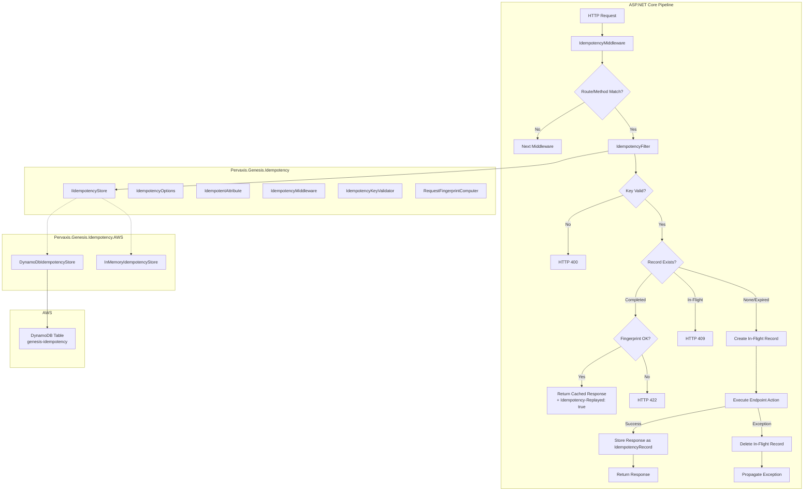
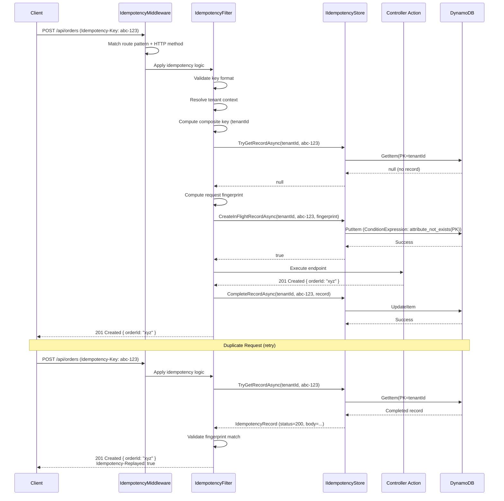

# Design Document: REST Idempotency

## Overview

The REST Idempotency module (`Pervaxis.Genesis.Idempotency` + `Pervaxis.Genesis.Idempotency.AWS`) provides transparent duplicate request detection and cached response replay for REST API endpoints within the Pervaxis Genesis platform. It intercepts HTTP requests bearing an `Idempotency-Key` header, stores response records in DynamoDB, and returns cached responses for repeated keys — preventing double-execution of side-effecting operations.

The module follows existing Genesis patterns:
- **Abstraction + AWS split** (`Pervaxis.Genesis.Idempotency` for contracts, `Pervaxis.Genesis.Idempotency.AWS` for DynamoDB implementation)
- **Standard DI registration** via `AddGenesisIdempotency` extension methods
- **Options validation** extending `GenesisOptionsBase`
- **Resilience** via `GenesisResiliencePipelineBuilder` (retry, circuit breaker, timeout)
- **Observability** via `PervaxisMeter`, `PervaxisActivitySource`, and `ILogger<T>` with source-generated `LoggerMessage`
- **Multi-tenancy** via `ITenantContext` for record isolation
- **Opt-in** via `[Idempotent]` attribute or middleware route patterns

### Design Rationale

1. **Fail-open on store unavailability** — If the idempotency store is unreachable, the system processes requests normally rather than blocking. This prioritizes availability over strict idempotency guarantees during outages.
2. **Attribute + Middleware dual opt-in** — Developers can selectively protect individual actions (attribute) or apply broad coverage to route groups (middleware). Attribute settings override middleware defaults for flexibility.
3. **Tenant-scoped composite keys** — Storage keys include tenant ID as a prefix, preventing cross-tenant key collisions in shared DynamoDB tables while supporting single-table design.
4. **Conditional writes for atomicity** — DynamoDB conditional expressions guarantee that only one concurrent request can claim an idempotency key, eliminating race conditions without distributed locks.

## Architecture



### Request Flow Sequence



## Components and Interfaces

### Project Structure

```
src/Pervaxis.Genesis.Idempotency/
├── Abstractions/
│   ├── IIdempotencyStore.cs
│   └── IdempotencyRecord.cs
├── Options/
│   ├── IdempotencyOptions.cs
│   └── IdempotencyMiddlewareOptions.cs
├── Extensions/
│   ├── IdempotencyServiceCollectionExtensions.cs
│   └── IdempotencyApplicationBuilderExtensions.cs
├── Filters/
│   ├── IdempotentAttribute.cs
│   └── IdempotencyActionFilter.cs
├── Middleware/
│   └── IdempotencyMiddleware.cs
├── Services/
│   ├── IdempotencyKeyValidator.cs
│   └── RequestFingerprintComputer.cs
├── Diagnostics/
│   ├── IdempotencyMetrics.cs
│   ├── IdempotencyTracing.cs
│   └── IdempotencyLogMessages.cs
└── Pervaxis.Genesis.Idempotency.csproj

src/Pervaxis.Genesis.Idempotency.AWS/
├── Providers/
│   └── DynamoDb/
│       ├── DynamoDbIdempotencyStore.cs
│       └── DynamoDbTableInitializer.cs
├── Fallback/
│   └── InMemoryIdempotencyStore.cs
├── Extensions/
│   └── IdempotencyAwsServiceCollectionExtensions.cs
└── Pervaxis.Genesis.Idempotency.AWS.csproj
```

### Core Interfaces

```csharp
namespace Pervaxis.Genesis.Idempotency.Abstractions;

/// <summary>
/// Abstraction for persisting and retrieving idempotency records.
/// All implementations must be thread-safe for concurrent calls with different keys.
/// </summary>
public interface IIdempotencyStore
{
    /// <summary>
    /// Retrieves an idempotency record if one exists and has not expired.
    /// </summary>
    /// <returns>The record if found and not expired; null otherwise.</returns>
    Task<IdempotencyRecord?> TryGetRecordAsync(
        string tenantId,
        string idempotencyKey,
        CancellationToken cancellationToken = default);

    /// <summary>
    /// Atomically creates an in-flight record if no unexpired record exists.
    /// Expired records are treated as nonexistent.
    /// </summary>
    /// <returns>True if created successfully; false if a record already exists.</returns>
    Task<bool> CreateInFlightRecordAsync(
        string tenantId,
        string idempotencyKey,
        string fingerprint,
        CancellationToken cancellationToken = default);

    /// <summary>
    /// Updates an existing in-flight record with the completed response.
    /// </summary>
    /// <returns>True if updated; false if no in-flight record exists.</returns>
    Task<bool> CompleteRecordAsync(
        string tenantId,
        string idempotencyKey,
        IdempotencyRecord record,
        CancellationToken cancellationToken = default);

    /// <summary>
    /// Removes a record. No-op if record doesn't exist.
    /// </summary>
    Task DeleteRecordAsync(
        string tenantId,
        string idempotencyKey,
        CancellationToken cancellationToken = default);
}
```

### Key Validator

```csharp
namespace Pervaxis.Genesis.Idempotency.Services;

/// <summary>
/// Validates idempotency key format and constraints.
/// Allowed: 1-256 characters, alphanumeric + hyphens + underscores + periods.
/// </summary>
public interface IIdempotencyKeyValidator
{
    /// <summary>
    /// Validates the key value and returns a validation result.
    /// </summary>
    IdempotencyKeyValidationResult Validate(string? keyValue, bool hasMultipleValues);
}

public readonly record struct IdempotencyKeyValidationResult(
    bool IsValid,
    string? ErrorCode,
    string? ErrorMessage);
```

### Request Fingerprint Computer

```csharp
namespace Pervaxis.Genesis.Idempotency.Services;

/// <summary>
/// Computes a deterministic fingerprint from HTTP method, route template, and body hash.
/// Uses SHA-256 for body hashing.
/// </summary>
public interface IRequestFingerprintComputer
{
    /// <summary>
    /// Computes fingerprint as: "{METHOD}|{routeTemplate}|{SHA256(body)}"
    /// </summary>
    Task<string> ComputeAsync(HttpContext context, CancellationToken cancellationToken = default);
}
```

### Idempotent Attribute

```csharp
namespace Pervaxis.Genesis.Idempotency.Filters;

/// <summary>
/// Enables idempotency handling on a controller action.
/// </summary>
[AttributeUsage(AttributeTargets.Method, AllowMultiple = false)]
public sealed class IdempotentAttribute : Attribute, IFilterFactory
{
    /// <summary>
    /// Per-endpoint TTL override. 0 means use global setting.
    /// Valid range: 1-10080 (when non-zero).
    /// </summary>
    public int TtlMinutes { get; set; } = 0;

    /// <summary>
    /// Per-endpoint fingerprint validation override. Null means use global setting.
    /// </summary>
    public bool? ValidateFingerprint { get; set; } = null;

    public bool IsReusable => true;

    public IFilterMetadata CreateInstance(IServiceProvider serviceProvider)
        => serviceProvider.GetRequiredService<IdempotencyActionFilter>();
}
```

### Middleware Options

```csharp
namespace Pervaxis.Genesis.Idempotency.Options;

/// <summary>
/// Configuration for the idempotency middleware route/method targeting.
/// </summary>
public sealed class IdempotencyMiddlewareOptions
{
    /// <summary>
    /// Route patterns to enable idempotency on (e.g., "/api/orders/{id}").
    /// </summary>
    public List<string> RoutePatterns { get; set; } = new();

    /// <summary>
    /// HTTP methods to apply idempotency to. Default: POST, PATCH.
    /// </summary>
    public HashSet<string> HttpMethods { get; set; } = new(StringComparer.OrdinalIgnoreCase)
    {
        "POST", "PATCH"
    };
}
```

## Data Models

### IdempotencyRecord

```csharp
namespace Pervaxis.Genesis.Idempotency.Abstractions;

/// <summary>
/// Represents a stored idempotency record containing the cached response.
/// </summary>
public sealed class IdempotencyRecord
{
    /// <summary>The idempotency key value.</summary>
    public required string IdempotencyKey { get; init; }

    /// <summary>The tenant-scoped composite storage key (tenantId#key).</summary>
    public required string CompositeKey { get; init; }

    /// <summary>Request fingerprint (method|route|bodyHash).</summary>
    public required string Fingerprint { get; init; }

    /// <summary>Whether the record is completed (response stored) or in-flight.</summary>
    public required bool IsCompleted { get; init; }

    /// <summary>HTTP status code of the cached response. Null if in-flight.</summary>
    public int? StatusCode { get; init; }

    /// <summary>Serialized response headers (JSON). Null if in-flight.</summary>
    public string? ResponseHeaders { get; init; }

    /// <summary>Response body bytes (Base64-encoded for DynamoDB). Null if in-flight.</summary>
    public string? ResponseBody { get; init; }

    /// <summary>UTC timestamp when the record was created.</summary>
    public required DateTimeOffset CreatedAt { get; init; }

    /// <summary>Unix epoch seconds when the record expires (DynamoDB TTL attribute).</summary>
    public required long ExpiresAtEpoch { get; init; }
}
```

### IdempotencyOptions

```csharp
namespace Pervaxis.Genesis.Idempotency.Options;

/// <summary>
/// Configuration for the Genesis Idempotency module.
/// Bound from "Genesis:Idempotency" configuration section.
/// </summary>
public sealed class IdempotencyOptions : GenesisOptionsBase
{
    /// <summary>DynamoDB table name. Default: "genesis-idempotency". Max 255 chars.</summary>
    public string TableName { get; set; } = "genesis-idempotency";

    /// <summary>Record TTL in minutes. Default: 1440 (24h). Range: 1-10080 (7 days).</summary>
    public int TtlMinutes { get; set; } = 1440;

    /// <summary>HTTP header name for the idempotency key. Default: "Idempotency-Key".</summary>
    public string HeaderName { get; set; } = "Idempotency-Key";

    /// <summary>Enable per-tenant record isolation. Default: true.</summary>
    public bool EnableTenantIsolation { get; set; } = true;

    /// <summary>Validate that reused keys correspond to the same request. Default: true.</summary>
    public bool ValidateRequestFingerprint { get; set; } = true;

    /// <summary>Resilience policy configuration for store operations.</summary>
    public ResilienceOptions Resilience { get; set; } = new();

    public override bool Validate()
    {
        if (!base.Validate()) return false;
        if (!UseLocalEmulator && string.IsNullOrEmpty(TableName)) return false;
        if (TableName?.Length > 255) return false;
        if (TtlMinutes < 1 || TtlMinutes > 10080) return false;
        if (string.IsNullOrEmpty(HeaderName)) return false;
        if (HeaderName?.Length > 128) return false;
        if (!Resilience.Validate()) return false;
        return true;
    }
}
```

### DynamoDB Table Schema

| Attribute | Type | Role |
|-----------|------|------|
| `PK` | String | Partition key — composite: `{tenantId}#{idempotencyKey}` |
| `Fingerprint` | String | Request fingerprint for validation |
| `IsCompleted` | Boolean | Whether response has been stored |
| `StatusCode` | Number | HTTP status code (null if in-flight) |
| `ResponseHeaders` | String | JSON-serialized response headers |
| `ResponseBody` | String | Base64-encoded response body |
| `CreatedAt` | String | ISO 8601 creation timestamp |
| `ExpiresAt` | Number | Unix epoch seconds — DynamoDB TTL attribute |

### Composite Key Construction

```
Tenant isolation enabled + tenant resolved:  "{tenantId}#{idempotencyKey}"
Tenant isolation enabled + no tenant:        "__global__#{idempotencyKey}"
Tenant isolation disabled:                   "__global__#{idempotencyKey}"
```

### Configuration Schema (appsettings.json)

```json
{
  "Genesis": {
    "Idempotency": {
      "TableName": "genesis-idempotency",
      "TtlMinutes": 1440,
      "HeaderName": "Idempotency-Key",
      "EnableTenantIsolation": true,
      "ValidateRequestFingerprint": true,
      "UseLocalEmulator": false,
      "LocalStackUrl": "http://localhost:4566",
      "Resilience": {
        "Enabled": true,
        "RetryCount": 3,
        "RetryDelayMs": 1000,
        "MaxRetryDelayMs": 30000,
        "CircuitBreakerFailureThreshold": 0.5,
        "CircuitBreakerMinimumThroughput": 10,
        "CircuitBreakerDurationSeconds": 60,
        "CircuitBreakerSamplingDurationSeconds": 30,
        "TimeoutSeconds": 30
      }
    }
  }
}
```

## Correctness Properties

*A property is a characteristic or behavior that should hold true across all valid executions of a system — essentially, a formal statement about what the system should do. Properties serve as the bridge between human-readable specifications and machine-verifiable correctness guarantees.*

### Property 1: Options Configuration Round-Trip

*For any* set of valid configuration values (TableName 1-255 chars, TtlMinutes 1-10080, HeaderName 1-128 chars, EnableTenantIsolation bool, ValidateRequestFingerprint bool), binding those values to `IdempotencyOptions` via either `IConfiguration` or `Action<IdempotencyOptions>` SHALL produce an options instance whose properties match the input values exactly.

**Validates: Requirements 1.5, 1.6**

### Property 2: Options Validation Correctness

*For any* `IdempotencyOptions` instance, `Validate()` SHALL return true if and only if: TableName is non-empty (or UseLocalEmulator is true) and ≤255 chars, TtlMinutes is in [1, 10080], HeaderName is non-empty and ≤128 chars, and `Resilience.Validate()` returns true. Conversely, *for any* options instance violating any of these constraints, `Validate()` SHALL return false.

**Validates: Requirements 2.8, 2.9, 2.10, 2.11, 2.12**

### Property 3: Idempotency Key Validation

*For any* string value, the key validator SHALL accept it (return valid) if and only if: it has exactly one value, is 1-256 characters long, and contains only characters matching `[a-zA-Z0-9\-_.]`. *For any* string that is empty, whitespace-only, exceeds 256 characters, or contains characters outside the allowed set, the validator SHALL reject it.

**Validates: Requirements 3.1, 3.3, 3.4, 3.5**

### Property 4: Cached Response Fidelity (Round-Trip)

*For any* completed `IdempotencyRecord` containing a status code, response headers, and response body, when a subsequent request arrives with the same idempotency key and matching fingerprint, the module SHALL return a response whose status code, headers, and body are byte-for-byte identical to the original stored response, plus an `Idempotency-Replayed: true` header.

**Validates: Requirements 4.1, 4.2**

### Property 5: Record Lifecycle State Machine

*For any* idempotency key, the record SHALL transition through exactly three states: (1) nonexistent → (2) in-flight → (3) completed. A key in state "nonexistent" accepts `CreateInFlightRecordAsync` (→ in-flight). A key in state "in-flight" accepts `CompleteRecordAsync` (→ completed) or `DeleteRecordAsync` (→ nonexistent). A key in state "completed" rejects `CreateInFlightRecordAsync` (returns false). An expired record in any state SHALL be treated as "nonexistent".

**Validates: Requirements 4.3, 4.4, 4.6, 10.3, 10.4, 10.5**

### Property 6: Fingerprint Determinism

*For any* HTTP method, route template, and request body bytes, computing the request fingerprint multiple times SHALL produce the same string value. *For any* two requests differing in method, route, or body content, their fingerprints SHALL differ.

**Validates: Requirements 5.1**

### Property 7: Fingerprint Mismatch Detection

*For any* completed or in-flight record with fingerprint F1, when a request arrives with the same idempotency key but a different fingerprint F2 (F1 ≠ F2) and `ValidateRequestFingerprint` is true, the module SHALL return HTTP 422 with error code `"IDEMPOTENCY_KEY_REUSE"`.

**Validates: Requirements 5.2, 5.3, 5.5**

### Property 8: Record Expiration Correctness

*For any* `IdempotencyRecord` with `ExpiresAtEpoch` ≤ current UTC epoch seconds, the store SHALL treat it as nonexistent: `TryGetRecordAsync` SHALL return null, and `CreateInFlightRecordAsync` SHALL succeed as if no record exists. The expiration value SHALL always equal `CreatedAt` (as epoch seconds) + (`TtlMinutes` × 60).

**Validates: Requirements 6.1, 6.3, 6.4, 4.7**

### Property 9: Composite Key Construction

*For any* tenant ID (not containing `#`) and idempotency key, the composite storage key SHALL be `"{tenantId}#{idempotencyKey}"` when tenant isolation is enabled and a tenant is resolved. *For any* configuration where tenant isolation is disabled OR no tenant is resolved, the composite key SHALL be `"__global__#{idempotencyKey}"`. *For any* tenant ID containing the `#` character, the request SHALL be rejected.

**Validates: Requirements 7.1, 7.2, 7.3, 7.5**

### Property 10: Route Pattern Matching

*For any* configured route pattern and HTTP request path, the middleware SHALL apply idempotency if and only if the path matches the pattern (case-insensitive) AND the HTTP method is in the configured method set (default: POST, PATCH). Non-matching paths or non-configured methods SHALL pass through without idempotency processing.

**Validates: Requirements 9.2, 9.3, 9.4, 9.6**

### Property 11: Store Atomicity (Create Mutual Exclusion)

*For any* idempotency key with no existing record, exactly one concurrent `CreateInFlightRecordAsync` call SHALL return true (success) and all others SHALL return false (conflict). This guarantees that at most one request can claim a given key.

**Validates: Requirements 10.3, 11.2**

### Property 12: Fail-Open Resilience

*For any* request where the idempotency store is unreachable (all retries exhausted or circuit breaker open), the module SHALL allow the request to proceed to the endpoint action and return the response to the client, without throwing an exception or returning an error status code caused by the store failure.

**Validates: Requirements 15.3, 15.4, 15.6**

## Error Handling

### Error Response Format

All error responses use RFC 7807 Problem Details:

```json
{
  "type": "https://pervaxis.io/problems/idempotency/{error-code}",
  "title": "Idempotency Error",
  "status": 400,
  "detail": "Human-readable error message",
  "instance": "/api/orders",
  "extensions": {
    "errorCode": "IDEMPOTENCY_KEY_MISSING",
    "traceId": "00-abc123..."
  }
}
```

### Error Code Catalog

| Error Code | HTTP Status | Condition |
|------------|-------------|-----------|
| `IDEMPOTENCY_KEY_MISSING` | 400 | Header not present on idempotency-enabled endpoint |
| `IDEMPOTENCY_KEY_INVALID` | 400 | Key empty, too long, invalid chars, or multiple values |
| `IDEMPOTENCY_KEY_IN_FLIGHT` | 409 | Same key being processed by another request |
| `IDEMPOTENCY_KEY_REUSE` | 422 | Key reused for a different request (fingerprint mismatch) |
| `IDEMPOTENCY_TENANT_INVALID` | 400 | Tenant ID contains disallowed `#` character |
| `IDEMPOTENCY_CONFIG_ERROR` | 500 | Invalid per-endpoint TTL configuration |

### Fail-Open Strategy

The module prioritizes availability over strict idempotency guarantees:

1. **Store read failure** (`TryGetRecordAsync`) → Process as new request, log warning
2. **Store write failure** (`CreateInFlightRecordAsync`/`CompleteRecordAsync`) → Return response to client, log error
3. **Store delete failure** (`DeleteRecordAsync` after endpoint exception) → Log error, propagate original exception
4. **Circuit breaker open** → Fail-open for all operations, log warning about degraded protection

### Endpoint Exception Handling

When the endpoint action throws an unhandled exception:
1. Delete the in-flight record (allowing retry)
2. If delete fails, log error about orphaned record
3. Propagate exception to normal ASP.NET Core error pipeline
4. Do NOT cache error responses

## Testing Strategy

### Property-Based Testing (FsCheck with xUnit)

The module uses **FsCheck** (v2.x) with xUnit for property-based testing. Each correctness property maps to one or more property tests with minimum 100 iterations.

**Library**: `FsCheck.Xunit` NuGet package
**Configuration**: 100+ iterations per property test
**Tag format**: `Feature: rest-idempotency, Property {N}: {title}`

Property tests target the pure logic components:
- `IdempotencyKeyValidator` — key format validation (Properties 3)
- `RequestFingerprintComputer` — fingerprint determinism (Property 6)
- `IdempotencyOptions.Validate()` — options validation (Property 2)
- Composite key construction logic (Property 9)
- Record expiration logic (Property 8)
- Route pattern matching (Property 10)

For stateful components (store operations, lifecycle, fail-open), property tests use mocked `IIdempotencyStore` to test the filter/middleware logic in isolation.

### Unit Testing (xUnit + NSubstitute)

Example-based unit tests cover:
- DI registration correctness (Requirements 1.1-1.4, 1.7, 1.8)
- Attribute behavior and precedence (Requirements 8.1-8.7)
- Metrics emission with correct tags (Requirements 12.1-12.5)
- Trace activity creation and tagging (Requirements 13.1-13.6)
- Structured log emission (Requirements 14.1-14.7)
- Resilience configuration (Requirements 15.1, 15.5)
- Error response format (all error codes)

### Integration Testing

Integration tests against LocalStack DynamoDB verify:
- Conditional write atomicity (Requirement 11.2)
- TTL-based expiration (Requirement 11.3)
- Item size limit handling (Requirement 11.4-11.5)
- Table auto-creation (Requirement 11.6, 17.2)
- In-memory fallback (Requirement 17.3-17.5)
- End-to-end request flow through middleware → filter → store → response

### Test Project Structure

```
tests/Pervaxis.Genesis.Idempotency.Tests/
├── Services/
│   ├── IdempotencyKeyValidatorPropertyTests.cs   ← Property 3
│   └── RequestFingerprintComputerPropertyTests.cs ← Property 6
├── Options/
│   └── IdempotencyOptionsPropertyTests.cs         ← Property 2
├── Filters/
│   ├── IdempotencyActionFilterTests.cs
│   └── IdempotencyLifecyclePropertyTests.cs       ← Properties 4, 5, 7, 8
├── Middleware/
│   └── RouteMatchingPropertyTests.cs              ← Property 10
├── KeyConstruction/
│   └── CompositeKeyPropertyTests.cs              ← Property 9
├── Resilience/
│   └── FailOpenPropertyTests.cs                  ← Property 12
└── Registration/
    └── ServiceCollectionExtensionsTests.cs

tests/Pervaxis.Genesis.Idempotency.AWS.Tests/
├── Providers/
│   └── DynamoDb/
│       ├── DynamoDbIdempotencyStoreTests.cs
│       └── DynamoDbAtomicityTests.cs              ← Property 11
├── Fallback/
│   └── InMemoryIdempotencyStoreTests.cs
└── Integration/
    └── EndToEndIdempotencyTests.cs
```
